# BurnLens Deschutes - Living Case Study

## The portfolio promise

BurnLens is an experimental CV-to-GEOINT portfolio project for technical and technical-adjacent reviewers. It aims to show one deep, reproducible path from versioned remote-sensing evidence to a segmentation model or justified baseline, georeferenced outputs, transparent maps, and an immutable run package.

It is not official wildfire information, emergency guidance, or an operational system.

## Current evidence, not future aspiration

BurnLens has established its governing task and source boundaries, selected exact Sentinel-2 and NOAA-21 VIIRS candidates, and implemented a fail-closed download validator. The validator caught a subtle but consequential failure: an unauthenticated data-looking URL returned an Earthdata Login HTML page with HTTP 200. BurnLens rejected and deleted it instead of registering it as NetCDF/HDF5.

The current candidate checkpoint shows the same reliability posture at the source-selection boundary. BurnLens compared the official McKenzie HUC8 NWI route with Milli's Sentinel/BAER/MTBS/RAVG route, retained every source-rights and trace gap, and selected neither. The exact report renders at desktop and narrow widths without turning metadata readiness into acquisition or label readiness.

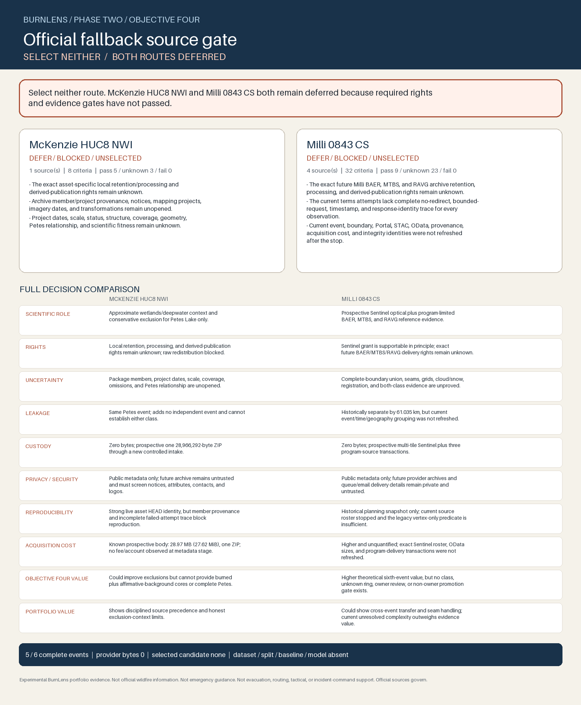

The next evidence-visible weakness was spatial scope. The original AOI was only a metadata-discovery box. Issue #321 found the exact public NIFC Darlene 3 final-perimeter reference and used it to derive a reproducible modeling boundary.

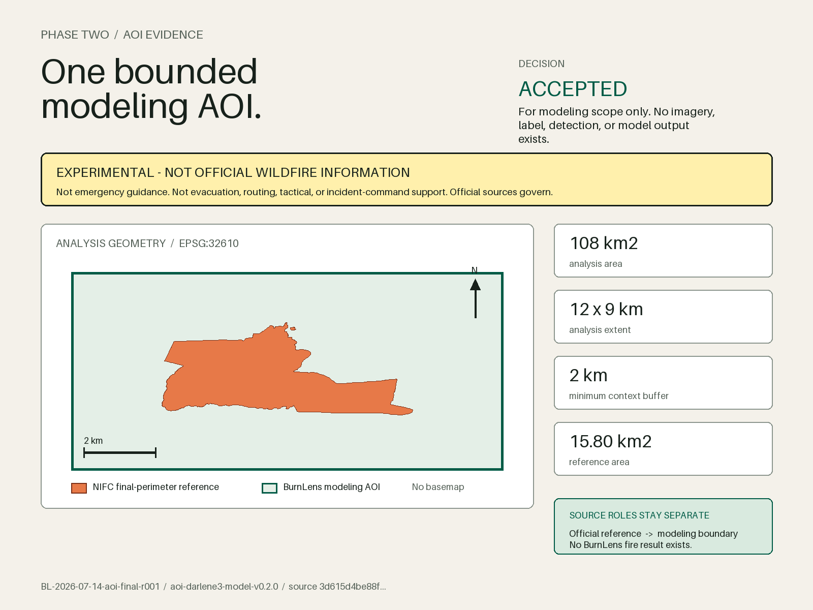

With the boundary fixed, issue #325 addressed the next reliability gap before credentials: the exact Sentinel scene and its VIIRS fire/geolocation pair must enter raw registration together or not at all.

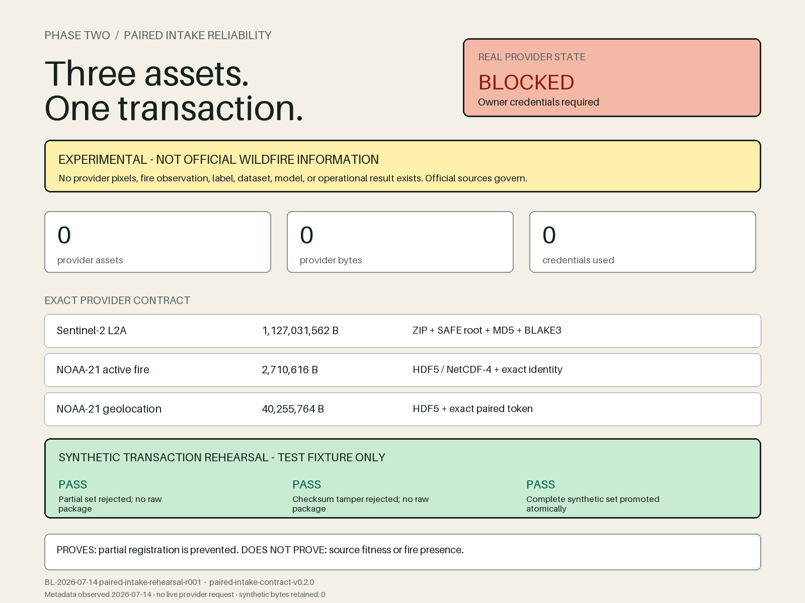

Issue #329 then crossed the data-evidence boundary. BurnLens acquired the exact package through the authorized CDSE and Earthdata accounts, re-verified all three files, opened the real raster and swath arrays, and rendered the result without committing raw provider bytes.

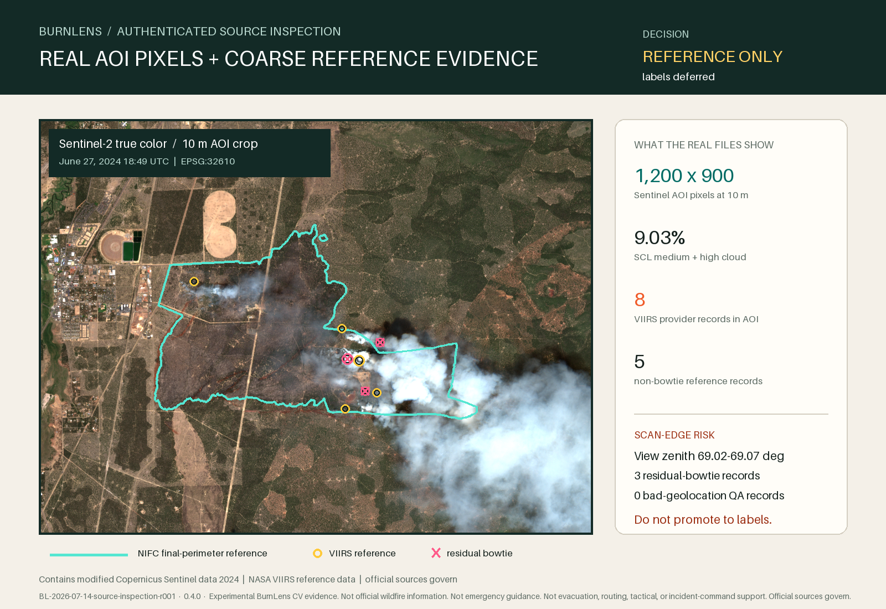

Issue #333 tested whether the extreme VIIRS scan geometry was a source limitation or a pass-selection limitation. BurnLens inspected every bounded NOAA-21 candidate and one exact selected companion, then rendered the complete comparison and uncertainty-preserving label-feasibility protocol.

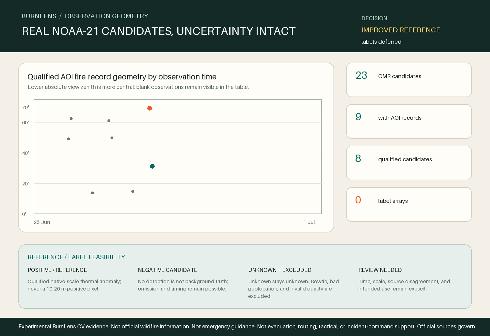

## Why the AOI matters

The final AOI is a 12 km by 9 km rectangle in WGS 84 / UTM zone 10N. It is derived by adding 2 km of context around the complete NIFC reference and snapping outward to a 1 km grid. That makes later clipping, tiling, checks, and explanation deterministic.

The source roles stay separate:

- NIFC geometry: authoritative incident-reference evidence, with mixed-method and no-warranty limitations.
- BurnLens AOI: an experimental analysis boundary.
- Model output: does not exist yet.

The real reference exposed and corrected an earlier planning assumption: it extends east of the discovery box. The final AOI is 48.1% smaller by projected bounding-area comparison but reaches 2.88 km farther east so the official reference is not clipped.

## Reliability evidence

- Immutable reference SHA-256: `3d615d4be88f65806399e3733491ab0d95e16ac91ea86b5a00b3ead81ec17abe`.
- Local projection matches NIFC's independent EPSG:32610 response within 0.000220 m.
- Official Census TIGERweb confirms the final envelope is within Deschutes County.
- Selected Sentinel and exact VIIRS pair metadata footprints contain the AOI.
- Sixteen repository tests pass, including checksum tamper failure, projection, containment, rendering, and byte-for-byte deterministic rebuilds.

These are source, geometry, coverage, and reproducibility claims. They are not fire-detection, label, dataset, baseline, model, or accuracy claims.

## Reliability before data touch

BurnLens `0.3.0` pins all three expected filenames, provider/native identifiers, exact sizes, container signatures, the VIIRS pair token, and the provider checksums that actually exist. A package fails before raw registration if any file is missing, unexpected, renamed, malformed, corrupt, unsafe, mismatched, checksum-invalid, link-backed, or multiply linked. Only a complete validated quarantine directory can be atomically promoted; an existing destination is protected. Contract `v0.4.0` hashes the asset identities and the complete transaction-invariant set together. If the final rename fails, its provisional manifest is removed and the same validated quarantine remains retryable. After promotion, the verifier rechecks the manifest, contract digest, exact files, and current hashes so later mutation is visible.

Before the owner authorized real access, BurnLens tested the transaction state machine with small temporary synthetic fixtures. The rehearsal rejects a partial set, rejects checksum tampering, promotes a complete set atomically, and deletes the synthetic tree. Its rendered `BLOCKED_OWNER_CREDENTIAL` state is historical evidence from before `ACCESS-2026-006`; its zero-provider values remain truthful for that run but no longer describe the current local workspace.

Thirty-seven repository tests and a byte-identical second report build pass. The report fixes the public-metadata observation at 2026-07-14 and explicitly states that deterministic rehearsals make no live provider request, so a later run time cannot masquerade as fresh research. A fourth rendered rehearsal check proves post-promotion mutation is detected. This proves transaction behavior and evidence honesty, not source delivery or remote-sensing fitness.

## What the real files prove

BurnLens `0.4.0` adds a runtime-only credential wrapper and exact-provider acquisition client. Authentication is host-scoped; redirects are HTTPS-only and allowlisted; cross-host authorization is stripped; signed queries never enter evidence; partial downloads are resumable but size-bounded; invalid partials are deleted. No username, password, token, cookie, signed URL, or credential-store detail is committed.

Acquisition run `BL-2026-07-14-authenticated-intake-r001` registered the exact three-file, 1,169,997,942-byte package in ignored local raw storage. The Sentinel ZIP has 95 members, one expected SAFE root, `manifest.safe`, matching provider MD5/BLAKE3, and clean CRC results. The two VIIRS assets match their exact sizes and native HDF5 signatures; their local SHA-256/MD5/BLAKE3 values are recorded without inventing provider checksums.

Inspection run `BL-2026-07-14-source-inspection-r001` reads the actual arrays:

- Sentinel true color: exact `1,200 x 900` AOI crop at 10 m on EPSG:32610.
- Sentinel SCL: exact `600 x 450` crop at 20 m, 9.0281% medium/high cloud, 0.1163% cloud shadow, and zero no-data pixels.
- VIIRS fire product: `6464 x 6400` mask, 65 consistent sparse records, and eight records inside the AOI.
- AOI fire records: six nominal, two high confidence, three residual-bowtie, and zero non-nominal-geolocation QA flags.
- Companion geolocation: all 10,342,400 coordinate pairs pass the implemented validity checks; AOI candidates lie only seven columns from the swath edge.

The strongest finding is a limit. The AOI fire records are observed at 69.02-69.07 degrees view zenith. The Sentinel and VIIRS observations are almost 47 minutes apart, and 375 m thermal anomalies cannot define 10-20 m segmentation boundaries. BurnLens therefore accepts the package for source/reference use and defers labels and a dataset. A second full inspection reproduces JSON, HTML, and PNG byte for byte; the semantic page was also verified in the in-app browser with no console errors or horizontal overflow.

## What the observation screen changes

BurnLens `0.5.0` queries the complete official CMR `VJ214IMG.002` inventory for the frozen AOI from June 25 through July 1, 2024. All 23 exact active-fire granules were acquired, integrity-checked, registered together, and inspected for actual AOI records. Nine contain AOI records, eight contain reference-qualified records, and five pass the declared conservative material-improvement rule.

The selected `A2024179.2118` day observation is genuinely better source geometry:

- 13 AOI records and 11 qualified native-scale references;
- zero residual-bowtie exclusions;
- 30.86-31.20 degree qualified view zenith, with a 31.01-degree median;
- 10 of 11 qualified records inside the later NIFC reference;
- an exact companion whose AOI geolocation pixels are more than 1,000 columns from the nearest scan edge.

This corrects the shipped pass-selection weakness. It does not create segmentation truth. The selected observation is 2.48 hours after Sentinel, and its 375 m support cannot define genuine 10-20 m boundaries. Protocol `weak-reference-label-feasibility-v0.1.0` therefore keeps positive references, negative candidates, unknowns, exclusions, and review-needed cases separate. No label array or dataset is created.

The exact 24-asset / 83,723,055-byte package remains ignored locally. An initial final-promotion attempt was rejected when OneDrive temporarily exposed one asset through a second hard link. The unchanged retry passed after the link disappeared, showing that an environmental race remains visible without weakening the gate. The committed JSON, HTML, and PNG rebuild byte for byte, and the semantic report passes real browser review with 23 candidate rows, no overflow, and no console warnings or errors.

## Target decision: burn-scar fallback active

The owner resolved the target-path gate on 2026-07-14: BurnLens will use the established burn-scar binary-mask fallback. The first CV task remains experimental binary semantic segmentation. Active-fire observations remain complementary thermal-anomaly reference evidence, not the direct label target.

Corrected run `TARGET-DECISION-2026-002` makes the choice inspectable. It carries forward the strongest active-fire evidence—375 m support, 2.48 hours from Sentinel, and a 31.01-degree qualified median view angle—while recording why those facts still cannot define genuine 10-20 m pixel truth. It defines burned, background-candidate, unknown, and excluded states as a design gate and creates no label array. The merged `001` run remains preserved because post-merge validation found that its MTBS input byte hash changed with checkout line endings; issue #339 corrected the serialization contract instead of rewriting that history.

MTBS was evaluated from current official sources because its analyst-interpreted fire-level products include pre/post imagery, burn indices, boundaries, thematic severity, and non-processing masks. Its current 2024 occurrence inventory returned 941 records but no Darlene name match, and both the 2024 and all-years occurrence layers returned zero features inside the frozen BurnLens AOI. MTBS therefore remains relevant methodology and potential cross-fire or future reference evidence; it cannot provide the exact Darlene 3 label today, and its severity classes will not expand BurnLens into a multiclass task.

The highest remaining risk is still burn-scar label truth across events. BurnLens has accepted ten balanced owner-approved prototype regions across Darlene, McKay, Tepee, Green Ridge, and Grandview, but five complete events remain below the six-event minimum and do not establish independent truth. Verified `v0.45.0-petes-lake-material-defer` preserves Petes Lake's controlled source-custody failure. Verified `v0.46.0-official-fallback-source-gate-defer` then proves that neither McKenzie HUC8 NWI nor Milli clears its bounded source gate. BurnLens does not turn partial custody or a least-bad source into labels. Issue #534 gives Windigo one final bounded attempt through July 27. Its exact 2,373,112,076-byte Sentinel pair now passes custody with both transport failures exposed, but no reference pixel or candidate is accepted. Any incomplete gate activates a technical-case-study-only August 6 submission path. No dataset can open unless a sixth complete event exists and the full sufficiency evaluator separately passes.

Petes Lake demonstrates why that failure-retention rule matters. Its first bounded NWI request returned the exact pre-registered official metadata bytes, but BurnLens's local validator collapsed qualified field names and falsely rejected the required `Wetlands.OBJECTID` type after a joined field overwrote it. The pipeline stopped before request two and preserved the failed contract, plan, terms receipt, dispatch receipt, and response. U05R1 checkpoint `8b0267e096654e919427947ca8a566352deb73c2` corrects the qualifier handling, rehashes the original evidence on every later state load, and registers a wholly disjoint r002 intake.

R002 validates the fix and safely promotes seven ordered assets: complete Wetlands metadata/count/ID/geometry/post-check evidence plus Data Source layer metadata. The next single-attempt Data Source pre-count POST fails before a response object opens, retaining a durable dispatch receipt and an exact zero-byte partial while leaving four later assets untouched. The code had discarded the underlying open exception, so BurnLens does not guess whether the cause was HTTP, timeout, DNS/TLS/socket, provider, request, or local network. U05R2 checkpoint `1b8c1ad52043536f243b178d279922ceb469103d` proves type-only controlled failure evidence, exact failed-byte rehash, all 24 prior-evidence bindings, same-source request equivalence, disjoint r003 custody, no retry, privacy, external-validator compatibility, and full offline regression coverage. Final r003 then independently promotes the same seven roles before its asset-eight open observes HTTP 500; four assets remain unexecuted. R003 is terminal and no r004 is authorized. This is reliability evidence—not completed custody, wetland fitness, reference truth, a candidate, or a sixth accepted event.

## Six event identities: metadata closes one gate, pixels keep the next closed

Issue #466 begins by reproducing the current official-source scout byte for byte. The older ranking is useful for Landsat-era challenge evidence, but it does not close the main Sentinel comparison gap. BurnLens therefore queries a bounded current pool and requires every Sentinel item to cover the complete MTBS boundary, then requires each pre/post pair to match platform, MGRS tile, relative orbit, and processing baseline.

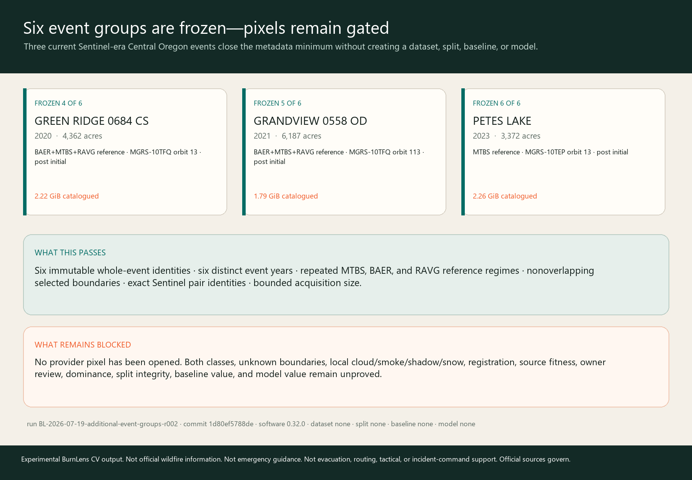

Green Ridge 2020, Grandview 2021, and Petes Lake 2023 win the predeclared ranking. They add three event years absent from the current pool; Green Ridge and Grandview replicate BAER/MTBS/RAVG evidence while Petes Lake adds a current MTBS-only regime. Across all six planned events, BAER appears four times, MTBS six times, and RAVG five times. The new selected boundaries do not overlap.

The plan freezes six exact Sentinel products totaling 6.277 GiB in catalogue metadata, but downloads none of them. That restraint is the result: BurnLens can now acquire one event at a time under an exact no-overwrite contract and stop immediately if notices, archive identity, native grids, local quality, registration, class feasibility, or unknown boundaries fail. The result is stronger portfolio evidence than a premature training run because it makes the next uncertainty visible and testable.

## Exact optical pair: clear evidence, deferred truth

Issue #343 selects and acquires two Sentinel-2A L2A Collection 1 products from the same tile, relative orbit, and processing baseline: one about an hour before the approximate incident start and one about ten days after. Both complete SAFE archives pass exact provider MD5/BLAKE3, local SHA-256, 95-member root/manifest/CRC, and independent registered-package verification. Their 2,254,805,631 provider bytes remain local and ignored.

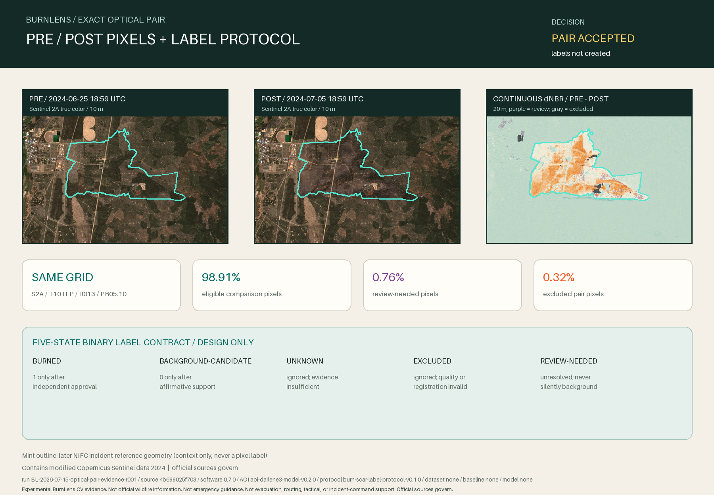

The exact AOI windows align without reprojection or resampling: 1,200 by 900 true color at 10 m and 600 by 450 B04/B8A/B12/SCL evidence at 20 m. Pairwise SCL rules retain 267,067 pixels / 98.9137% as eligible comparison, 2,063 / 0.7641% as review-needed, and 870 / 0.3222% as excluded. Both scenes are readable; the continuous dNBR view shows a coherent change pattern around the later incident-reference outline.

That is evidence that the pair is useful, not evidence that every changed pixel is burned. The ten-day interval can include vegetation, moisture, atmosphere, soil, mixed-pixel, and registration effects. The dNBR display uses a fixed disclosed color stretch but no classification or severity threshold. SCL 7 remains review-needed, and the mint NIFC outline is later mixed-method context, never a pixel label.

Protocol `burn-scar-label-protocol-v0.1.0` therefore defines five states. Burned and background-candidate may later map to binary 1/0 only after affirmative evidence and an accepted review route. Unknown, excluded, and review-needed remain outside loss and metrics. The current owner-confirmed route still requires disclosed evidence, boundary review bands, event/scene/geography/time grouping before tiling, recorded uncertainty, and independent software QA; it does not create independent human validation.

The acquisition itself adds useful reliability evidence. One response ended early and remained resumable; a later server response ignored Range, so the client safely restarted instead of appending. OneDrive twice created temporary upload-staging hard links, and the transaction rejected both races. The second race exposed an unnormalized local `ValueError`; BurnLens added regression-tested secret-free state normalization before the unchanged retry.

The decision is `ACCEPT_OPTICAL_PAIR_FOR_PROTOCOL_DEFER_LABELS`. No label array, state raster, dataset, split, baseline, model, metric, application, deployment, or operational claim is created.

## Pair-local registration: a prerequisite, not truth

Issue #347 isolates local content registration before any label proposal. Exact source-grid equality is necessary but cannot prove that scene content is aligned. BurnLens `0.8.0` therefore measures twelve fixed native-20m windows with independent pre/post B04, B8A, and B12 reflectance gradients, a Hann taper, phase-only cross-power, and localized 100x DFT refinement.

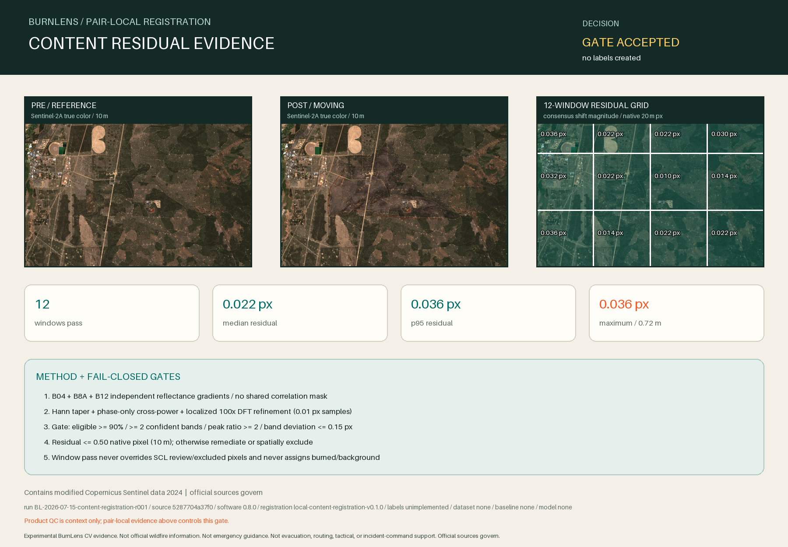

The method deliberately applies no shared quality or stable-pixel mask to the correlation signals; a common mask can create an artificial zero-shift peak. NIFC geometry, VIIRS observations, dNBR, burn/background assumptions, and label thresholds do not steer the measurement. Pair quality determines window usability only.

All twelve windows pass the frozen gate. Median residual is 0.0224 native pixel; p95 and maximum are 0.0361 pixel, about 0.72 m. The least eligible window retains 94.96% eligible pixels, all three bands are confident everywhere, minimum peak ratio is 7.5916, and maximum band disagreement is 0.04 pixel.

The packaged Sentinel geometric reports are preserved but do not substitute for this evidence. Both globally pass, while both also state that VNIR/SWIR bands have not been registered and spatio-residual histograms were not computed. A first final JSON audit caught that the initial parser missed those sibling message/value nodes; BurnLens corrected the parser and fixture before accepting the artifacts.

Decision `ACCEPT_LOCAL_CONTENT_REGISTRATION` clears only the local translation prerequisite. Window passes never override pixel-level SCL review/excluded states and never assign burned or background. The next bounded risk is a reviewable five-state label proposal with independent QA, not dataset construction or model training.

## Five-state proposal: visible uncertainty, exact software QA

Issue #353 turns the protocol into inspectable native-grid evidence without pretending it is ground truth. BurnLens 0.9.0 recomputes dNBR, NDVI loss, SWIR gain, and NIR loss from the exact registered pair. It requires affirmative context, multi-signal change, and local coherence for burned candidates; affirmative multi-signal stability away from the reference for background candidates; and keeps quality, boundary, disagreement, and inconclusive evidence in explicit ignored states.

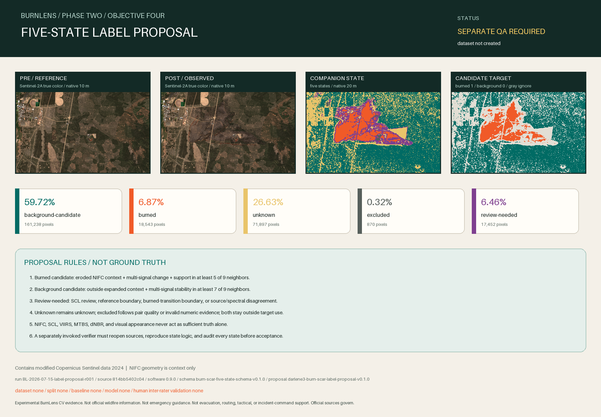

The result proposes 161,238 background pixels and 18,543 burned pixels. It does not force complete coverage: 71,897 pixels remain unknown, 870 excluded, and 17,452 review-needed. In total, 33.4144% of the AOI stays outside target use.

The first real diagnostic was visibly speckled. BurnLens responded in the method, not the presentation: burned evidence must be supported in at least five of nine neighboring cells and stable background in at least seven. This reduced isolated candidates while leaving genuine uncertainty visible.

A separate module and CLI then reopen the source package, recompute every signal and state without importing the proposal classifier, validate the GeoTIFF trace contract, and compare all 270,000 pixels. State and target agreement are both 100%. A deterministic audit samples 20 pixels from every state plus 20 burned-transition-boundary pixels; all 120 agree.

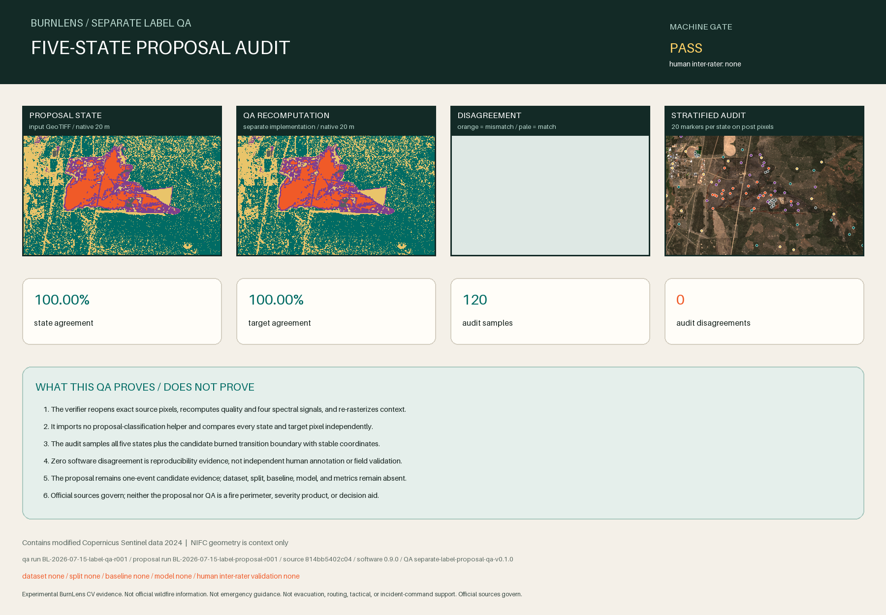

That QA proves implementation reproducibility under one frozen contract. It does not prove independent human annotation, field validity, label accuracy, or generalization: the same Codex director authored both paths, only one event is represented, and no leakage-resistant multi-event split exists. Decision `ACCEPT_REVIEWABLE_LABEL_PROPOSAL_DEFER_DATASET` therefore accepts the evidence and stops short of a dataset.

## Cross-event feasibility: group first, acquire second

Issue #357 starts by reproducing all eight shipped proposal/QA artifacts byte for byte. Rather than tile Darlene and manufacture sample count, BurnLens 0.10.0 queries current official MTBS, Census TIGERweb, and CDSE STAC metadata and freezes a normalized source snapshot before assessing candidates.

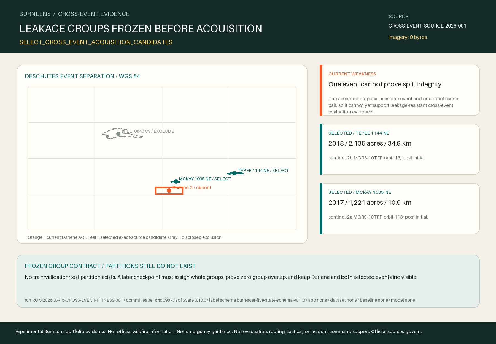

The bounded search returns 84 MTBS occurrences in the discovery envelope, 23 with representative points inside Deschutes County, and three recent wildfire candidates under the declared date/type/size rule. Tepee 1144 NE and McKay 1035 NE each have a compatible same-platform, tile, relative-orbit, and processing-baseline Sentinel pair. Milli 0843 CS has many intersecting items but zero single tiles covering its complete MTBS boundary, so it remains visible and excluded instead of being silently cropped or mosaicked.

The report freezes whole event, exact-scene, geography, and time group IDs before any acquisition or tiling. Darlene-McKay, Darlene-Tepee, and McKay-Tepee representative-point distances are 10.925, 34.926, and 27.258 km. Those are transparent diagnostics, not proof that spatial autocorrelation disappears.

Decision `SELECT_CROSS_EVENT_ACQUISITION_CANDIDATES` authorizes only the next source-fitness checkpoint. No selected product route was exercised; no provider imagery, cross-event label, dataset, partition, baseline, model, or generalization evidence exists. This is a portfolio-strengthening act of restraint: independence is designed before patch generation, while unsupported readiness stays visibly null.

## Cross-event source fitness: exact bytes, honest exclusions

Issue #361 acquires only the four frozen Tepee/McKay products. Four attempts fail closed on early EOF, transient metadata access, non-resumable full responses, and OneDrive link races before run `BL-2026-07-16-cross-event-optical-intake-r005` registers the exact 4,551,170,756-byte package. Provider MD5/BLAKE3, local SHA-256, ZIP/SAFE/root/manifest/CRC/path, and atomic-promotion gates all pass; native archives remain local and ignored.

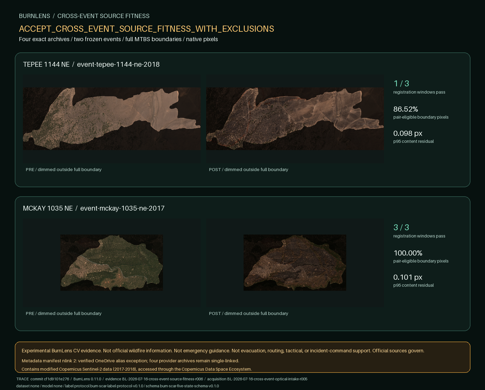

The source-fitness path opens exact native pixels and counts quality only inside each complete MTBS boundary. McKay is 100% pair-eligible and all three registration windows pass. Tepee is deliberately not flattened into a green check: 8.3441% remains review-needed, 5.1341% excluded, W-01 excluded, W-02 review-needed, and W-03 pass.

The real storage environment also stays visible. OneDrive creates a second link to the small registration metadata manifest, while all four provider archives remain single-linked. BurnLens accepts that cross-event metadata-only exception only after one-read SHA-256 and complete registration/asset comparison, and shows it in the rendered evidence.

Decision `ACCEPT_CROSS_EVENT_SOURCE_FITNESS_WITH_EXCLUSIONS` clears only a cross-event five-state proposal and separate-QA experiment. It does not create labels, a dataset, a split, a baseline, a model, an accuracy claim, independent human validation, or field evidence.

## Cross-event proposal transfer: differences stay visible

Issue #367 applies the same five-state contract to Tepee and McKay using their four exact Sentinel archives and two exact public MTBS annual-reference clips. MTBS supports or complicates the proposal as analyst-interpreted remotely sensed evidence; it never becomes automatic truth.

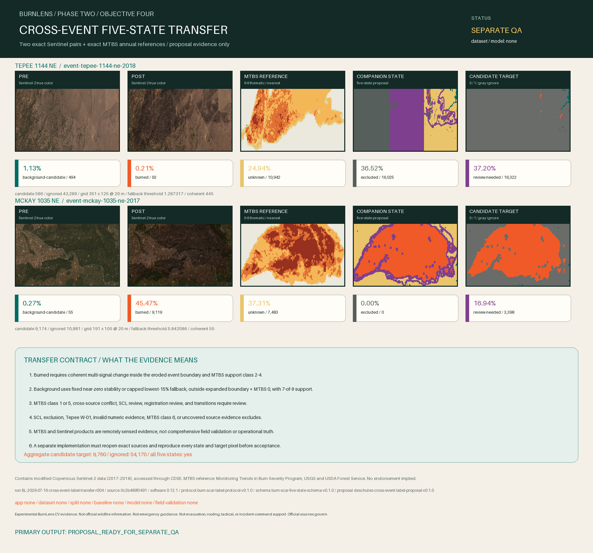

The events do not collapse into a tidy common pattern. Tepee retains 16,025 excluded and 16,322 review-needed pixels, with only 586 candidates. McKay contains 9,174 candidates and zero excluded pixels because its source-fitness gate passed everywhere; BurnLens records the absent state instead of manufacturing one. Aggregate output preserves all five states: 549 background, 9,211 burned, 18,425 unknown, 16,025 excluded, and 19,720 review-needed.

The inherited fixed near-zero stability rule finds no primary stable McKay pixels. The owner-authorized fallback admits only the lowest 15% normalized non-burn tail outside the expanded boundary with MTBS 0, caps the score at 6.0, and requires seven-of-nine coherence. It recovers 55 McKay background proposals. The report exposes threshold `5.842086` and calls it event-relative rather than calibrated accuracy.

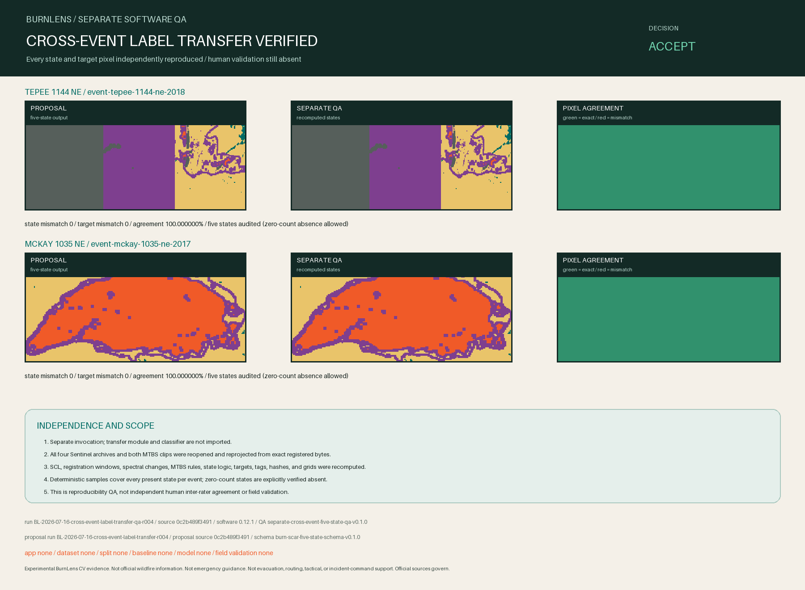

The next cycle exposed a subtler reproducibility weakness. OneDrive moved the registered MTBS clips from an approved exact-two-link topology to an equally approved one-link topology. Every pixel and render stayed fixed, but public JSON changed because it serialized the current link count. BurnLens `0.12.1` keeps the fail-closed runtime gate and exact content checks while removing that transient count from public run identity. Real one-link and exact-two-link packages now produce all ten corrected files byte for byte; a third link is rejected. The original `2026-001` evidence remains preserved rather than rewritten.

A separately invoked implementation that does not import the proposal classifier reopens all six source assets and independently reproduces all 63,930 state and target pixels. State and target mismatch are both zero, and 45 deterministic audits agree. Live-browser review also catches and fixes potentially misleading claim grammar before the final `r003` artifacts.

Decision `ACCEPT_CROSS_EVENT_LABEL_TRANSFER_PROPOSAL_DEFER_DATASET` is deliberately narrower than dataset acceptance. Software agreement proves reproducibility of the rules, not independent human label quality, field validity, universal calibration, or model readiness.

## Reviewing the proposal without reviewing our own homework

Issue #375 starts by reopening all six registered Sentinel archives and both MTBS clips, rebuilding the Darlene 3, Tepee, and McKay proposals, and requiring exact agreement with the committed rasters. Only then does BurnLens sample the evidence for review.

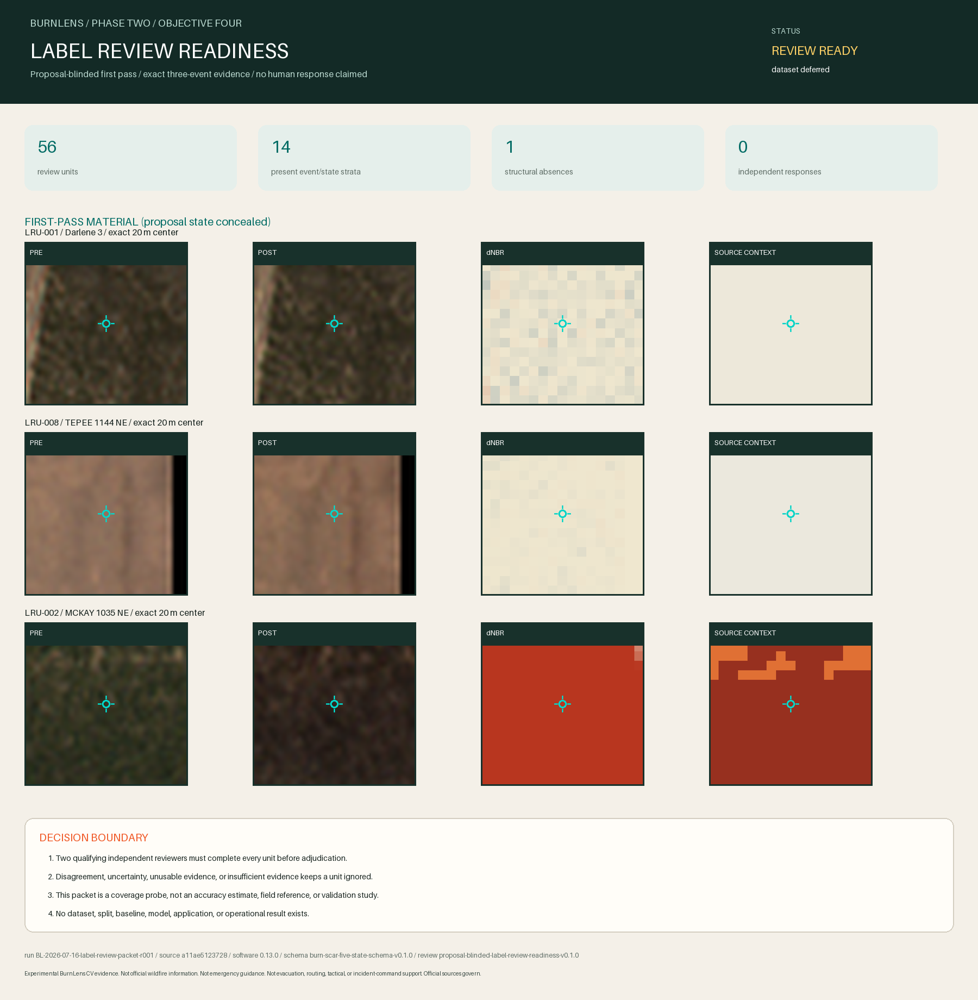

The packet selects four units from every proposal state present in each event: 56 units across 14 present event/state strata. McKay contains no excluded proposal pixels, so that absence remains explicit instead of being filled with a synthetic or off-contract example. Preferred spatial separation reduces near-duplicate context within each stratum, while a second deterministic hash mixes the presentation order.

The first-pass pages show pre/post Sentinel true color, fixed-display continuous dNBR, and NIFC or MTBS context. They do not disclose the sample-specific BurnLens state or binary target. Those values live on a separate reveal page, and the blank response/adjudication templates contain no proposal-value fields. This is proposal-blinded workflow design, not a claim of cryptographic blindness or controlled study conditions.

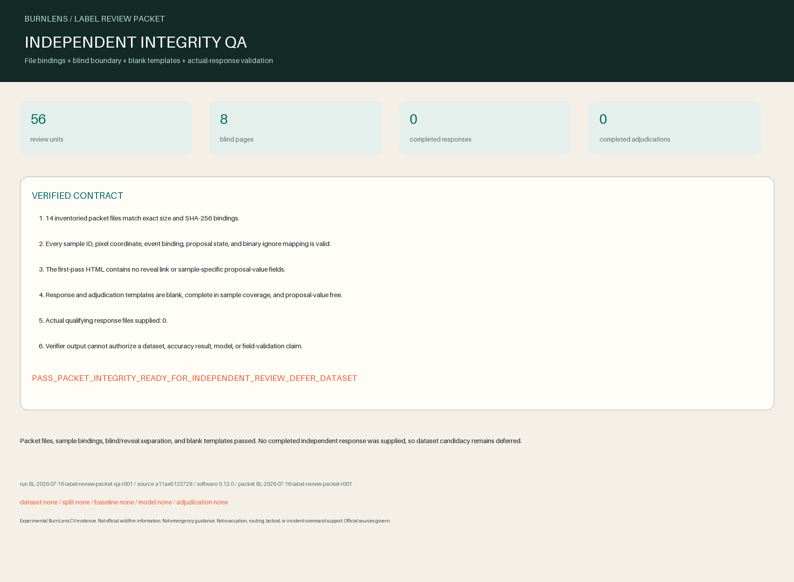

The independent verifier checks the packet JSON binding and 14 referenced packet outputs, 56 unique pixel bindings, coverage, the blind/reveal boundary, blank evidence state, response domains and attestations, timestamp order, and the rule that unknown, excluded, and review-needed never become binary targets. `MANIFEST-2026-015` separately inventories all 18 packet/QA files. All integrity gates pass. Completed independent responses: zero. Completed adjudications: zero.

Decision `ACCEPT_PROPOSAL_BLINDED_REVIEW_READINESS_DEFER_DATASET` therefore accepts the instrument, not the labels. Codex authored the proposal and review tooling and cannot count as an independent reviewer. The next evidence must come from qualifying reviewers whose first-pass responses are locked and hashed before reveal; disagreements must be adjudicated or remain ignored.

## Giving the reviewer an isolated offline workbench

Rerunning the shipped packet exposed a practical contradiction: BurnLens had carefully separated the blind pages from the reveal, but the reviewer still had to hand-edit a 56-entry JSON file inside the repository directory that contained proposal-bearing material.

Issue #379 keeps every scientific selection and source pixel fixed while changing the delivery boundary. BurnLens `0.14.0` creates one deterministic offline archive containing only safe instructions, the blank response contract, eight blind pages, and a self-contained workbench.

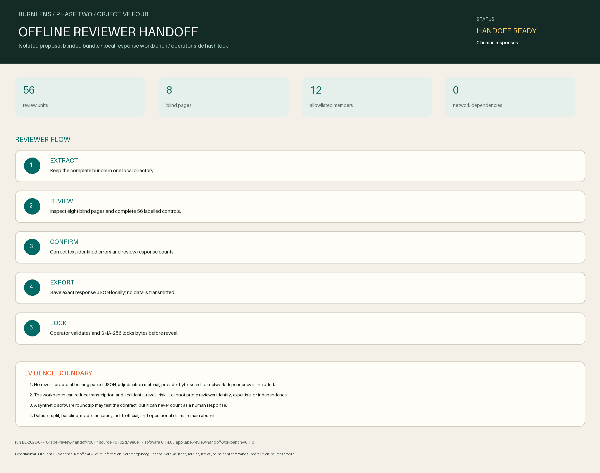

The workbench uses one labelled form for all 56 units. It supplies the decision vocabulary, progress and error feedback, local draft save/load, a final review step, and exact response JSON export. It makes no network request, stores no response in browser storage, and exposes no proposal reveal.

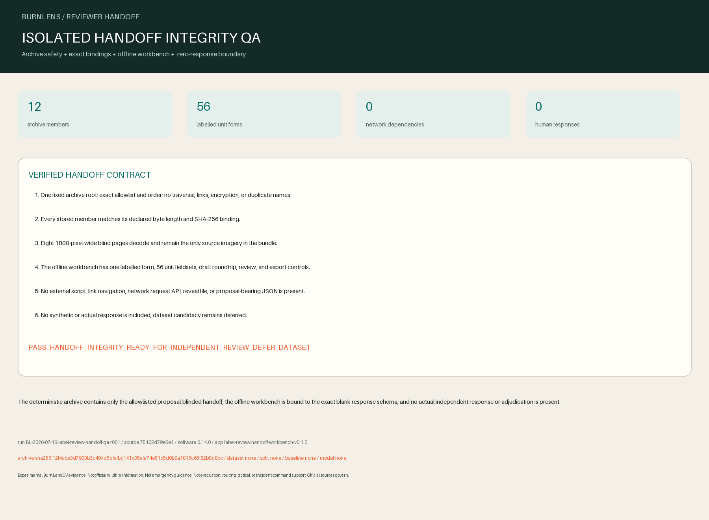

A separately implemented verifier checks the archive allowlist, paths, order, modes, timestamps, hashes, embedded response contract, interface semantics, and eight PNGs. The returned-response path then validates the exact packet binding and writes a SHA-256 receipt before reveal. That digest proves the returned bytes are the recorded bytes; it does not prove reviewer identity, expertise, independence, or scientific correctness.

All seven public outputs and the local 12-member archive reproduce byte for byte. The synthetic complete-response test proves the software contract only. No independent human response or adjudication exists. The interactive browser runtime was unavailable, so the shipped checkpoint makes no viewport, console, draft/load, or download interaction claim.

## Running the exact reviewer surface instead of inferring it works

The missing browser sentence became the next checkpoint. Issue #383 reconstructs the exact 8,652,301-byte archive and launches its extracted `file://` workbench in installed Chrome `150.0.7871.124` with a temporary isolated profile.

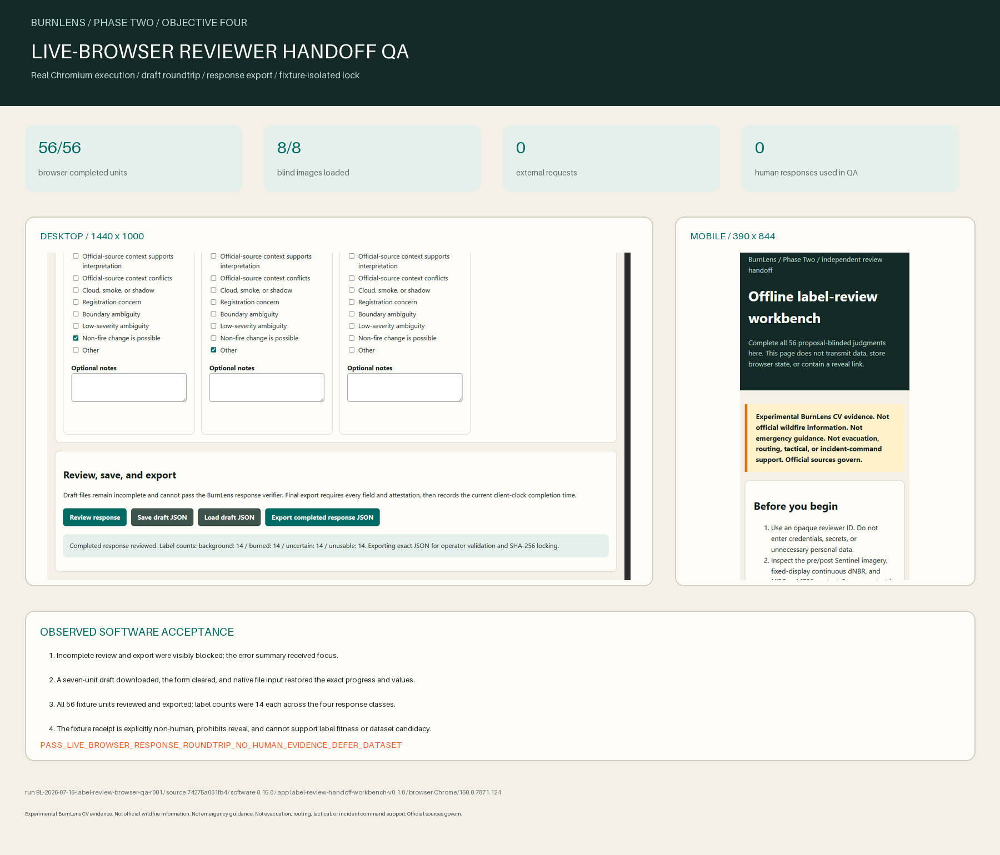

The browser is driven through the same controls a reviewer uses. Empty review/export exposes 61 incomplete items and focuses the error surface. Seven completed units are downloaded as a real draft, the form is cleared, and the native file input restores the exact values and progress. All 56 units then complete and export under the pinned response schema.

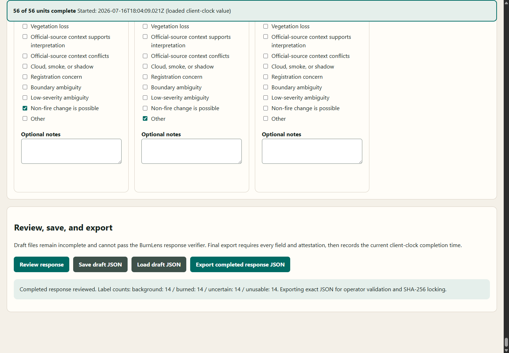

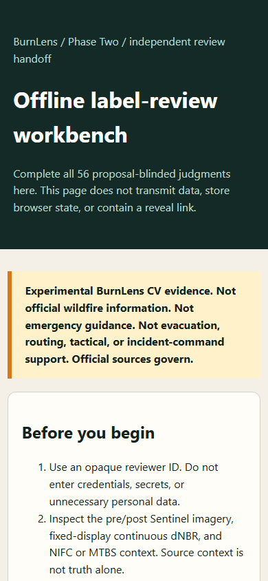

The desktop 1440 by 1000 and mobile 390 by 844 views have no horizontal overflow. The inspected page target records no external resource request, console error, runtime exception, cookie, or local-storage entry. The loopback DevTools control plane is disclosed separately.

The exported labels are deliberately balanced software data: 14 each burned, background, uncertain, and unusable. Its receipt says `software-browser-fixture`, qualifying-human false, and reveal prohibited. That distinction is more important than the green checks: one browser acceptance run proves the interface contract, not cross-browser conformance, reviewer qualification, label accuracy, or scientific validity.

One actual returned response arrived after this run and was preserved and operator-locked under issue #384. Its exact bytes and notes remain private and it is not folded into the browser fixture evidence. At that checkpoint the reveal remained unopened and the original protocol still required a second response. The later owner waiver superseded that gate without fabricating reviewer two; issue #403 subsequently opened and reconciled the reveal under reduced validation.

## Proving custody without publishing the first review

The first real response changes the evidence problem. Before looking at agreement or label fitness, BurnLens must prove that the returned file is the file later analyzed and must avoid leaking its contents to a second reviewer.

BurnLens `0.16.0` preserves the exact 16,443-byte response and a separate 2,508-byte receipt in ignored repository-local storage. A new public verifier independently checks the response digest, the shipped packet and 56-unit contract, the private receipt binding, and receipt chronology.

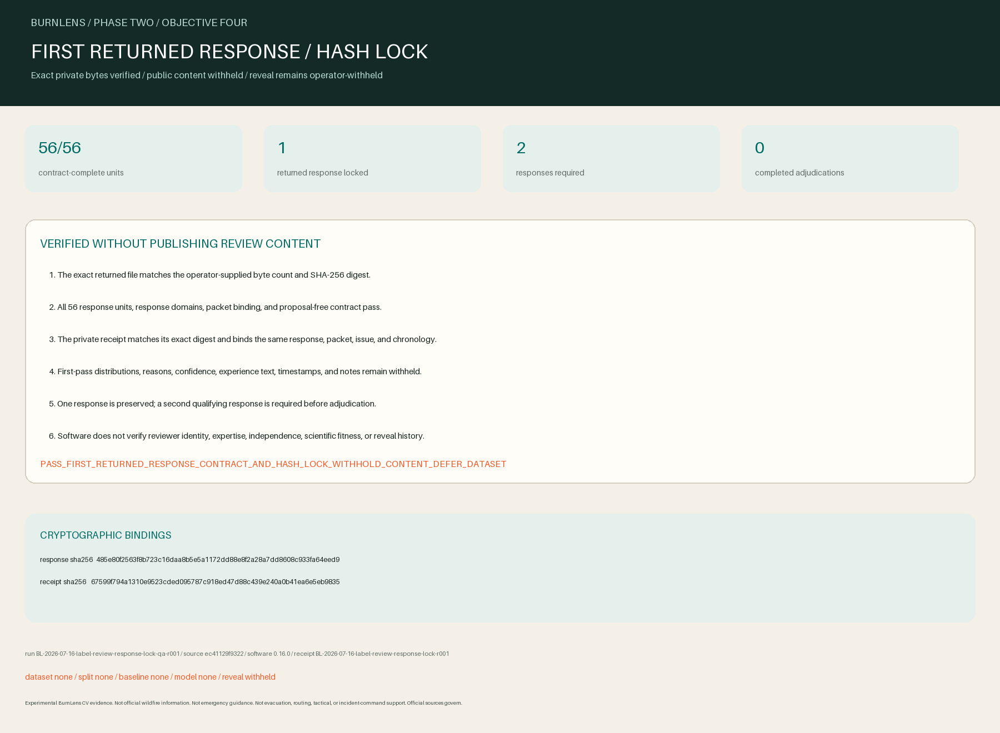

The tracked report publishes both cryptographic bindings, 56-of-56 completion, one response preserved, two required, and zero adjudications. It deliberately withholds label, evidence-sufficiency, confidence, and reason distributions; reviewer experience; response timestamps; free-text notes; private filenames; and private paths. The reveal status is an operator declaration, not a software-verifiable claim.

This is evidence custody, not label acceptance. It makes the eventual comparison more defensible while refusing to manufacture agreement from one response.

## Proving the second-lock path without inventing a reviewer

The next custody risk was technical rather than scientific: the first private receipt was created under BurnLens `0.15.0`, while the next returned response will be locked by newer software. BurnLens must preserve the historical bytes exactly and still prove that two independently locked responses can coexist before any content is revealed.

BurnLens `0.17.0` keeps the v0.2.0 / `0.15.0` historical identity supported and makes new receipts identify v0.3.0 / `0.17.0`. A separately transcribed dual verifier checks two exact response/receipt pairs without importing the receipt builder.

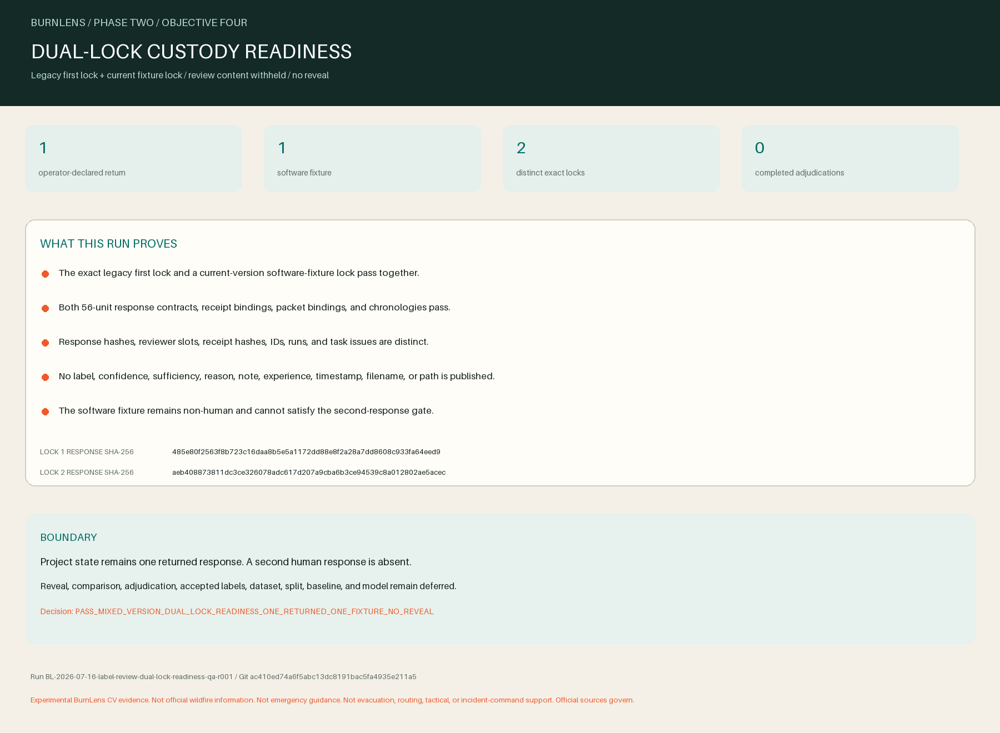

The authoritative readiness run uses the actual ignored first response and receipt plus the exact browser-QA response re-locked as a current-protocol software fixture. It proves two distinct exact locks, packet and contract binding, chronology, origin separation, privacy, and a readable public result. It also keeps the most important state red: only one origin is an operator-declared returned response, the other is explicitly non-human and reveal-prohibited, and the minimum human custody count remains unmet.

That is the portfolio point of this checkpoint. BurnLens tests the failure-prone custody mechanism before a second person’s work arrives, but refuses to turn a software fixture into agreement evidence. Reveal, comparison, adjudication, and dataset work remain blocked until a second qualifying human response is locked.

## Removing the manual response-intake seam

The dual-lock verifier exposed one remaining reliability gap: after a completed file arrives, an operator still has to copy it into custody before creating the receipt. A wrong source, partial copy, overwrite, or source change during that interval would weaken every later comparison.

BurnLens `0.18.0` turns that interval into one bounded transaction. It validates the inbound response, rejects duplicate hashes and reviewer slots, stages exact bytes in the destination directory, flushes and fsyncs them, checks the source again, validates the preserved copy, builds an identical receipt from source and copy, and promotes response plus receipt without overwrite. Partial promotion rolls back both outputs.

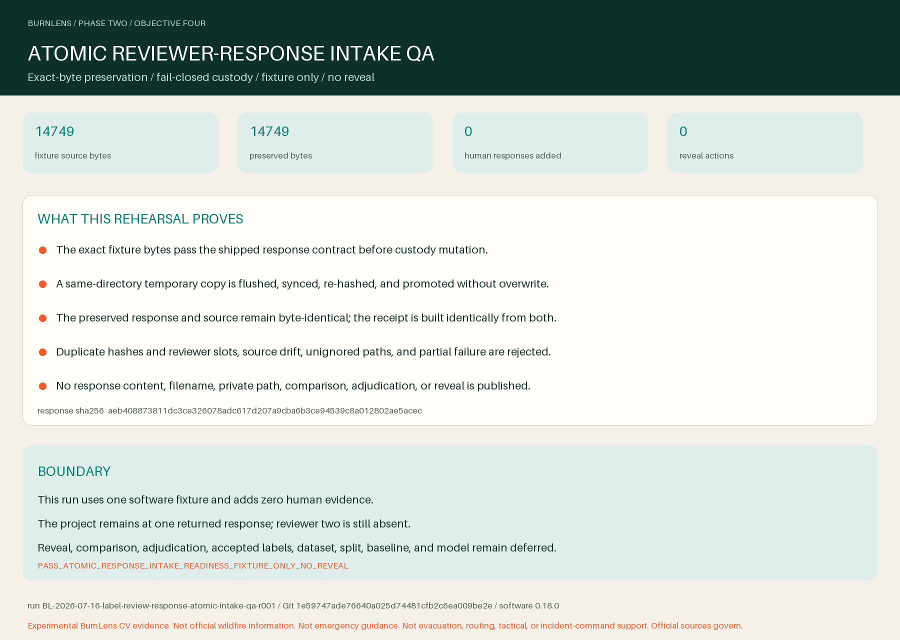

The authoritative rehearsal uses the existing software fixture. Source and preserved bytes both equal 14,749, the v0.4.0 private receipt is independently hash-bound, and public evidence shows zero human responses added and zero reveal actions. All six historical first-lock and dual-lock artifacts still regenerate byte-for-byte.

This is a reliability improvement, not a scientific result. The project still has one returned human response. Software does not prove who created a file, whether the reviewer is qualified, what happened before intake, or whether storage survived every possible hardware failure.

The owner subsequently waived reviewer two. BurnLens records the resulting single-response reconciliation as immutable historical evidence, not independent truth. Issue #393 is closed as superseded, and issue #403 preserves the 6 burned / 0 background / 50 ignored outcome plus its disclosed reveal sequence exception. No inter-rater agreement, consensus, or adjudication can be claimed.

## Reopening prototype decisions with stronger disclosed evidence

On 2026-07-17 the owner replaced the prospective independent/blinded acceptance route with an owner-confirmed prototype workflow. Codex will propose evidence-backed burned/background candidates, show the relevant optical/reference evidence, and collect yes/no/uncertain. A yes is necessary but not sufficient: reproducibility, source, quality, and event-level leakage gates must also pass. No and uncertain remain excluded. All original 56 units will be reopened rather than inheriting the historical exclusions.

The first improvement under that route is evidence discovery, not relabeling. BurnLens `0.23.0` scouts seven current official source classes and ranks 21 additional Deschutes candidate fires while the exact seven-bundle request remains pending. GW Fire ranks first because it offers event/time/geography diversity, BAER/MTBS/RAVG coverage, and 64 live Landsat burned-area metadata matches.

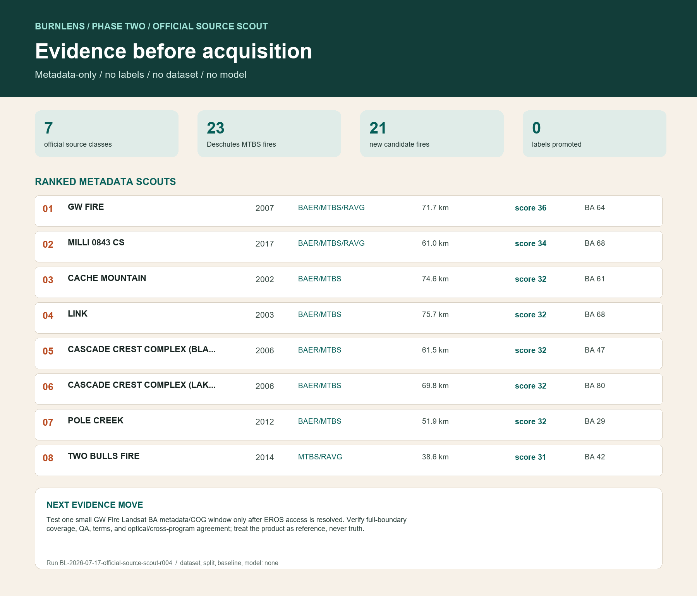

Delivery then removed the metadata-only bottleneck. BurnLens `0.24.0` preserves two exact USGS archives privately and opens all seven accepted BAER/RAVG/MTBS products through a fail-closed inspector. The public fitness report compares current categorical products with every frozen five-state proposal pixel while leaving those states unchanged.

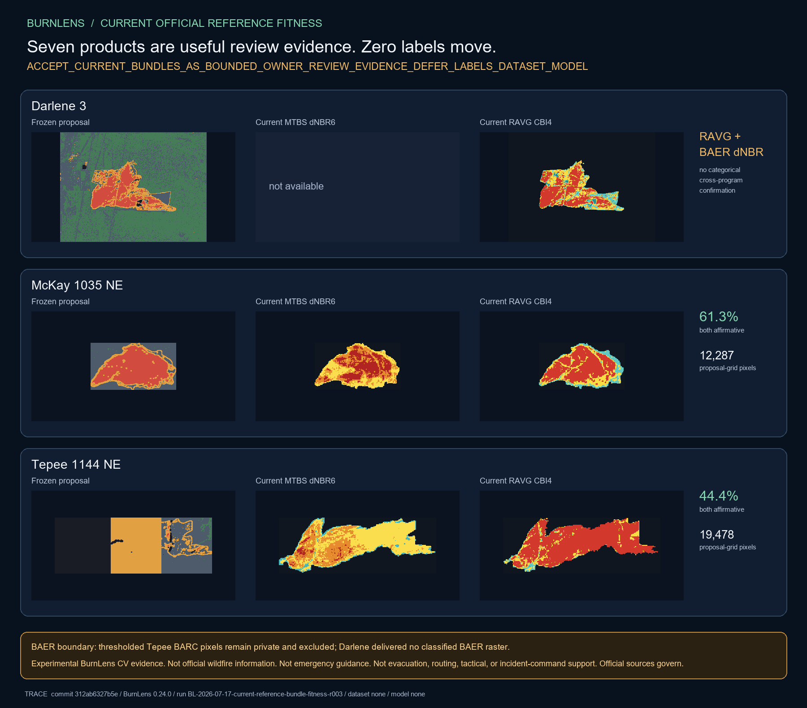

Current MTBS and RAVG agree affirmatively on all 9,119 McKay and 92 Tepee burned proposal pixels. They are jointly non-affirmative for all 55 McKay and 493 of 494 Tepee background candidates. Darlene has RAVG plus unthresholded BAER dNBR context but no categorical cross-program confirmation: the delivered BAER folder contains no classified raster. Legacy thresholded Tepee BARC remains private and excluded under its distribution restriction. These are strong review cues, not ground truth, field validation, owner decisions, or labels.

BurnLens `0.25.0` turns that evidence into one repository-owned owner-review surface. All 56 original units are reopened as 35 burned and 21 background propositions; the historical 6/0/50 response is not imported. Each question shows the original pre/post optical chip, continuous dNBR, frozen source context, permitted current categorical/continuous reference evidence, the proposition basis, and any quality blocker. All 32 unknown, excluded, or review-needed origins remain blocked after a future yes.

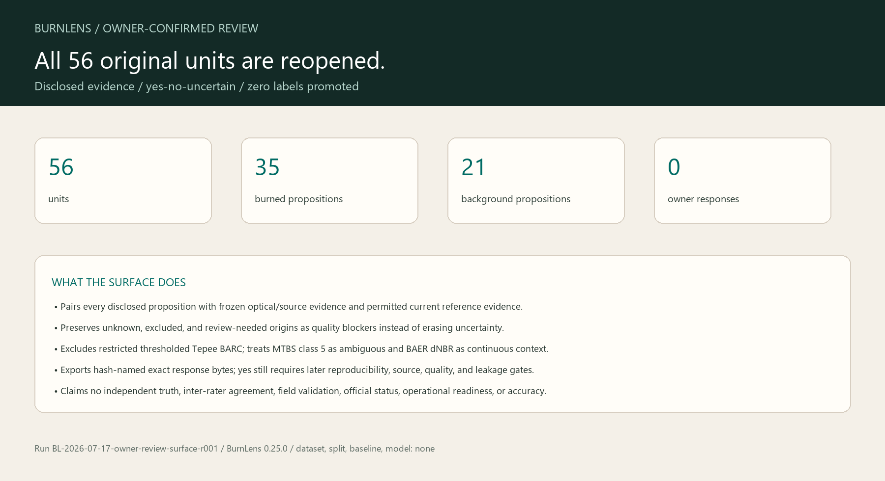

The shipped template was blank. The owner later completed all 56 questions and explicitly identified one exact export as authoritative. BurnLens `0.26.0` preserves those bytes privately, excludes older exports, reconstructs every proposition, and applies the disclosed promotion gates without publishing notes or unit decisions.

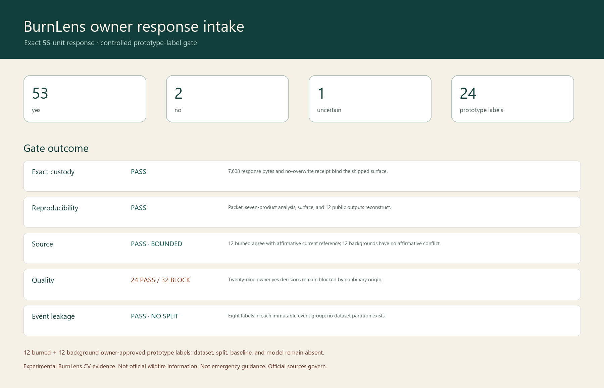

The response contains 53 yes, 2 no, and 1 uncertain. Exactly 24 yes units also pass reproducibility, bounded source-direction, frozen binary-origin quality, and immutable event-group gates: 12 burned and 12 background, balanced as eight per event. Twenty-nine yes units remain quality-blocked; no and uncertain remain excluded. These are explicitly owner-approved prototype labels, not ground truth or a dataset. The Landsat route remains optional future evidence. No split, baseline, model, accuracy, field validation, official status, endorsement, or operational readiness follows.

BurnLens `0.27.0` tests whether those points are enough. They cover only 0.012662% of the 189,541 candidate-domain pixels and are center pixels rather than masks. With three event groups, every nonempty train/validation/test assignment has one event per role; each event also has a distinct reference regime. The balanced proposal-stratified sample cannot support natural prevalence or independent evaluation.

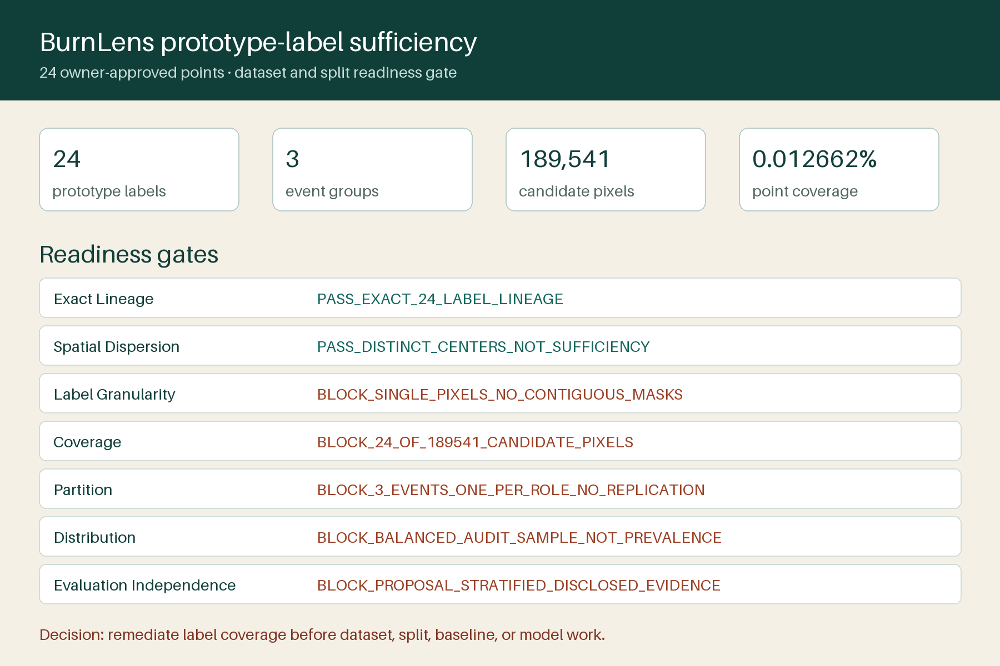

BurnLens therefore stops before dataset creation and requires contiguous reviewed regions, more event/source diversity, natural-distribution sampling, and independent evaluation evidence. The refusal to manufacture training readiness is part of the portfolio evidence.

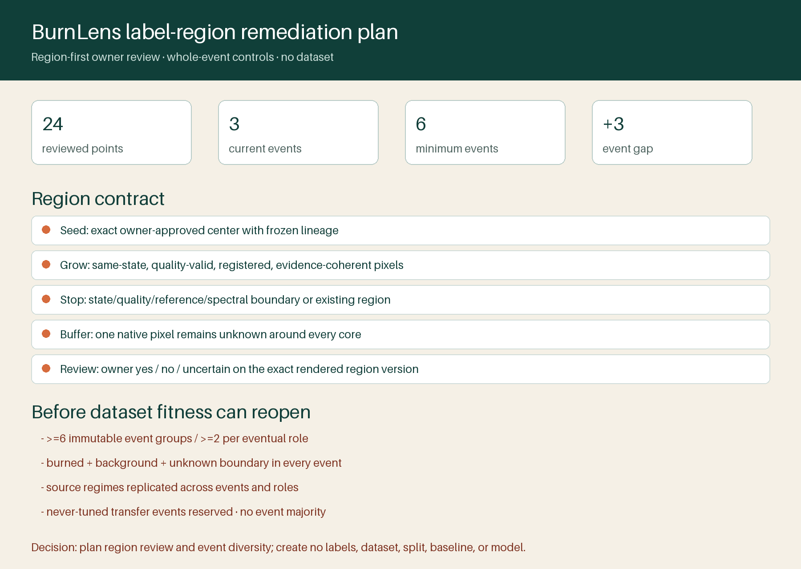

The next plan is equally explicit about what not to do. A point does not become a mask through buffering or tiling. BurnLens proposes deterministic evidence-coherent native-grid regions, surrounds every core with an unknown ring, and asks the owner to review the exact rendered version. Dataset fitness remains closed until at least six whole-event groups replicate classes and evidence regimes, including never-tuned transfer events. Older Landsat-era fires remain sensor-shift challenges unless a separate comparable-sensor contract passes.

BurnLens `0.29.0` then executes that plan on the actual Darlene, McKay, and Tepee packages. It selects one intact proposed burned and one intact proposed background component per event, keeps the one-hectare target as a ranking preference rather than a clipping rule, and publishes six exact cores with one-native-pixel unknown rings. The 136 core pixels and 246 ring pixels are candidate evidence, not labels.

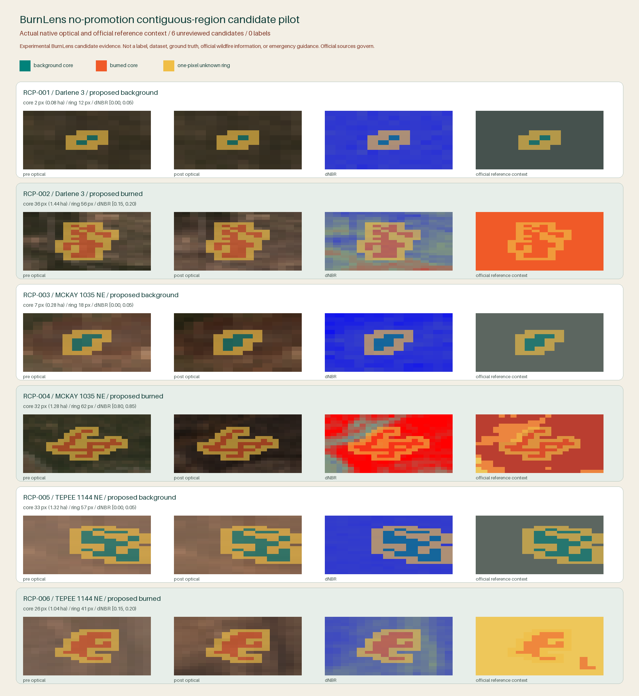

Verified BurnLens `0.30.0` makes those exact immutable bytes owner-reviewable. Each yes/no/uncertain question binds the candidate raster hash and shows pre/post optical evidence, dNBR, permitted official reference context, core, and ring. Draft/export bytes are hash-named; a completed export locks every response control, including the file loader. The shipped checkpoint deliberately contains zero owner responses and promotes zero regions. Issue #461 keeps returned-response preservation, validation, and any later promotion decision separate.

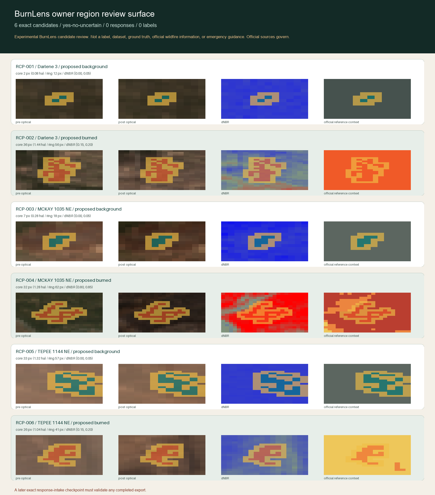

BurnLens `0.31.0` then preserves the exact completed export before interpretation and reruns every promotion gate against the real candidate rasters. All six owner yes decisions pass as explicitly owner-approved prototype regions: three burned, three background, and 136 accepted core pixels across Darlene, McKay, and Tepee. All 246 ring pixels remain unknown and excluded. The public report is aggregate-only; unit decisions, notes, private paths, and seed identities remain private.

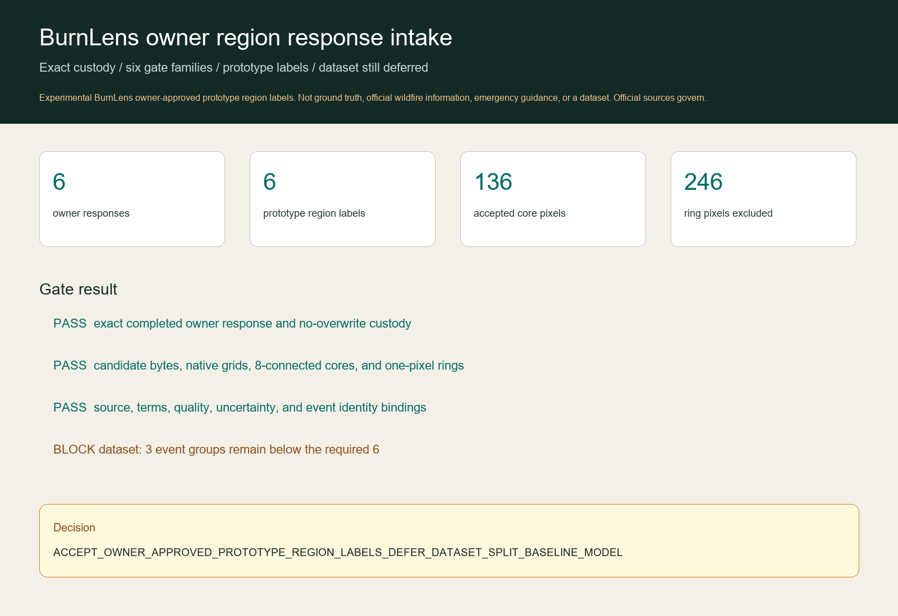

That is meaningful label evidence, but it is still not a dataset. Three event groups remain below the required six, so BurnLens continues to defer splits, baselines, models, metrics, and readiness claims.

The first merged-main reconstruction caught checkout-dependent Markdown record hashes and withheld the release. A provenance-only remediation preserves each historical EOL identity explicitly; a separate fresh remote-main clone then reconstructs all three aggregate outputs exactly. Verified `v0.31.0-region-owner-response-intake` therefore ships the evidence without concealing the failed first release gate.

## Opening the Green Ridge background route

The next three checkpoints move one additional event from metadata to evidence without pretending that official program classes are ground truth. BurnLens 0.33.0 acquires the exact Green Ridge Sentinel pair and passes native quality and registration. BurnLens 0.34.0 preserves the exact BAER/MTBS/RAVG delivery and finds 41,642 optical-grid pixels where MTBS and RAVG both provide affirmative burned-candidate evidence. Neither checkpoint can affirm a background region.

BurnLens 0.35.0 starts by rerunning that blocked workflow. The existing two-scene stability route produces only two isolated outside-footprint pixels, so it is rejected before acquisition. Current CDSE metadata then freezes one exact 2021 near-anniversary Sentinel-2B scene with the same platform, tile, orbit, and processing baseline as the 2020 pre-fire scene. Its 1,193,992,663 provider bytes remain ignored; exact local and provider hashes bind custody.

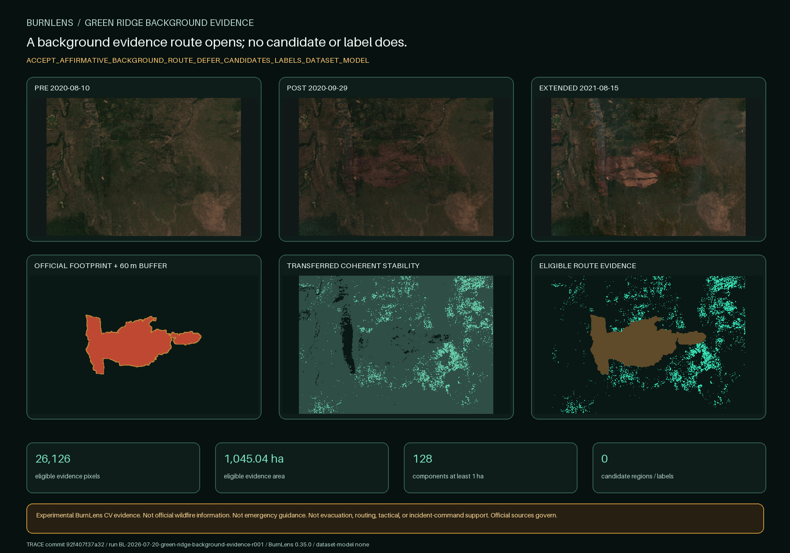

All nine fixed registration windows pass. BurnLens transfers the already established four-signal optical-stability thresholds without tuning, requires coherent neighborhood support, requires both MTBS and RAVG encoded class 0, and excludes 60 m around either source footprint. The conjunction retains 26,126 20 m pixels / 1,045.04 ha and 128 components of at least one hectare.

This is a route for proposing review regions, not an official unburned map. Encoded class 0, outside-footprint position, SCL, low change, or apparent stability is insufficient alone. The checkpoint creates zero candidates and zero labels. Issue #483 keeps deterministic region selection and later owner yes/no/uncertain review separate.

BurnLens 0.36.0 then applies the already established region-candidate contract to that frozen evidence. It selects one intact 25-pixel burned component and one intact 25-pixel background component without clipping or threshold retuning. A deterministic SHA-256 tie-break resolves equally sized components, and every core receives a one-native-pixel unknown ring.

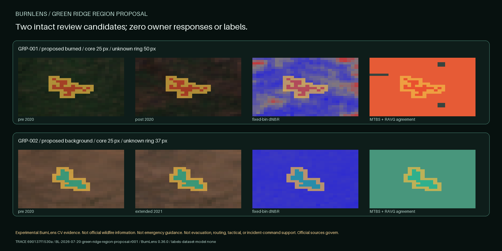

The two exact EPSG:32610 rasters contain 50 proposed core pixels and 87 unknown-ring pixels. They remain unreviewed. Issue #487 owns a blank yes/no/uncertain surface; response intake and any prototype-label decision remain separate.

## Accepting Green Ridge without calling it ground truth

BurnLens 0.37.0 binds both exact cores to a self-contained owner surface with pre-fire, post-fire, extended optical, dNBR, and MTBS/RAVG evidence. The owner completes both questions and exports one hash-named file. BurnLens 0.38.0 preserves those exact bytes and a receipt in ignored no-overwrite custody before opening either answer.

Both answers are yes, but neither becomes a label by vote alone. The intake reopens the exact proposal report and rasters, verifies native grids and connected cores, proves all 87 ring pixels remain unknown, binds the resolved source and terms records, and re-runs quality, registration, reproducibility, and event-identity gates. Both 25-pixel cores pass.

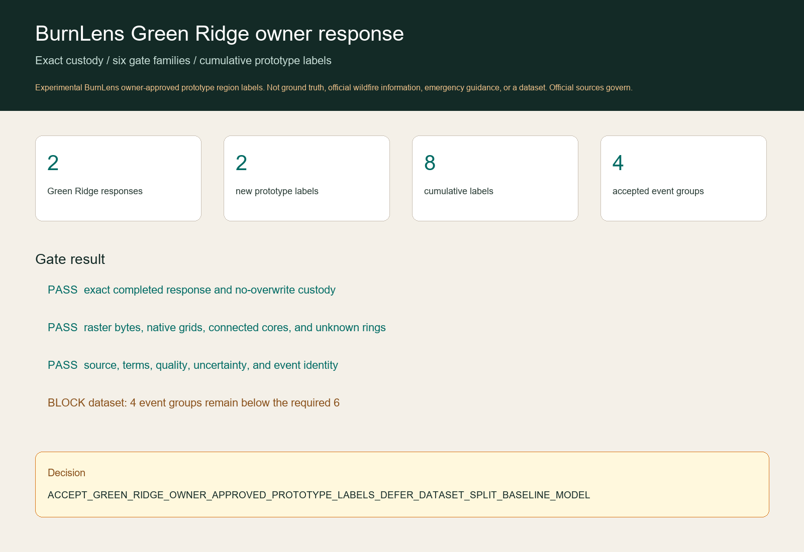

At the Green Ridge checkpoint, the cumulative prototype set was balanced at four burned and four background regions, 186 core pixels / 7.44 ha, and 333 excluded ring pixels across four events. That was materially stronger label evidence, but still not a dataset. Grandview and Petes Lake still had to pass equivalent event-level gates before splits or baselines could begin.

## Grandview crosses the optical evidence gate

The next cycle reran the shipped event planner and confirmed Grandview was still the highest-leverage missing event. BurnLens refreshed the two frozen CDSE identities and current Sentinel terms before downloading anything, then preserved the exact 1,923,481,794-byte Sentinel-2B pair only in ignored repository-local custody. Both archives pass provider checksums, local SHA-256, safe-root, manifest, and full CRC gates.

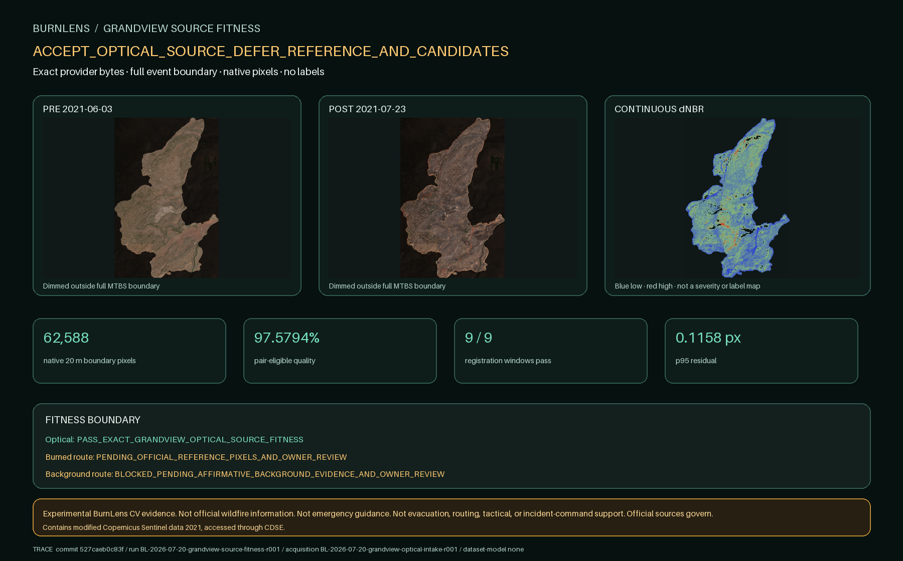

The actual full event boundary contains 62,588 native 20 m pixels. Pair quality is 97.5794% eligible, 1.0337% review-needed, and 1.3868% excluded. All nine fixed registration windows pass, with 0.1158-pixel p95 residual. The visible continuous dNBR distribution is useful change evidence, but it is deliberately not thresholded into severity or a label.

This checkpoint sharpens rather than relaxes the next gate. Grandview BAER, MTBS, and RAVG identities are known, but none of their pixels were opened in this run. Burned and affirmative-background candidates therefore remain unavailable, and the existing eight-region/four-event prototype set does not change. Issue #499 owns exact reference-pixel fitness before any Grandview proposal or owner review.

### Grandview reference fitness: source strength does not erase model limits

P2O4-T28 retrieves the exact 22,076,790-byte official delivery and deterministically inspects all 20 native rasters, six metadata documents, and three boundary packages. MTBS covers 98.7330% of the verified optical boundary; classes 2-4 occupy 58,438 pixels, with 56,943 also passing optical pair validity. That is enough to open a separate burned-candidate proposal route, not to create a label.

The more important portfolio decision is what BurnLens refuses to infer. Grandview's delivered RAVG record warns that much of the event has sparse to no pre-fire tree cover, outside the model's strongest domain. Even though the RAVG maps appear to agree broadly with MTBS, the public report marks them as limited context and does not treat that visual agreement as independent truth. BAER remains preliminary continuous change, 793 optical-boundary pixels remain outside MTBS grid coverage, and no program supplies affirmative background truth. Issue #503 therefore targets background evidence before a balanced owner-review proposal.

### Grandview background evidence: geometry and stability must agree

BurnLens freezes one same-platform, same-tile, same-orbit Sentinel-2B scene from 2022-06-28, 25 days after the pre-fire anniversary. The exact 950,987,607-byte archive stays in ignored custody. Its reprocessed 05.10 baseline differs from the original 05.00 pair, so the pipeline applies each product's own BOA scale and offsets and then runs real content registration. Seven windows pass and two are spatially excluded; none fail and p95 residual is 0.0944 pixel.

The first implementation correctly rejected itself: BAER's continuous raster was finite across its rectangle and could not stand in for an incident perimeter. The corrected route parses and rasterizes the exact delivered BAER, MTBS, and RAVG boundary vectors, buffers their union by 60 m, transfers the established four-signal stability thresholds without tuning, and retains only three-scene-valid coherent pixels outside every footprint and registration exclusion.

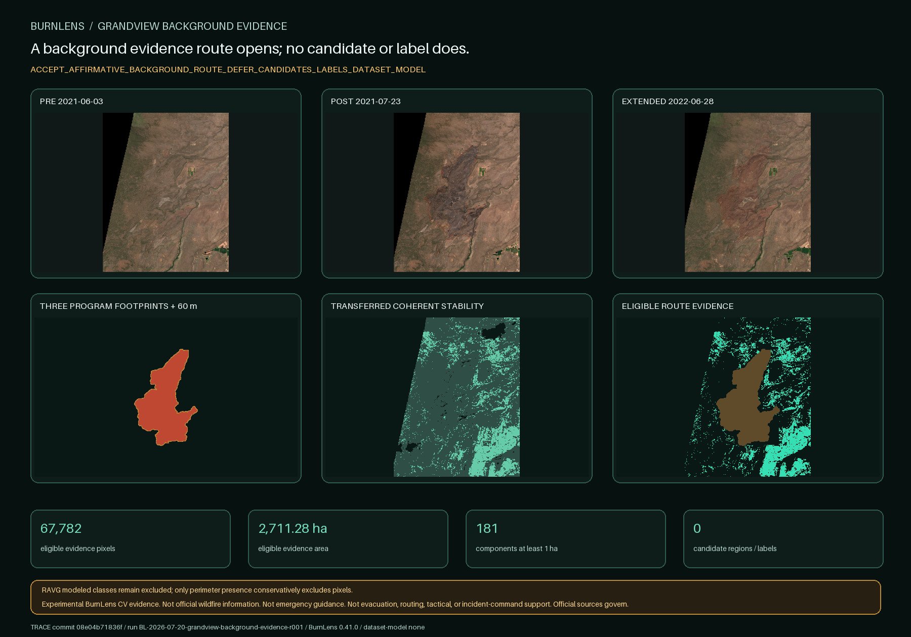

The result contains 67,782 evidence pixels / 2,711.28 ha and 181 components at least one hectare. Fresh merged main repeats 312 tests with 13 expected custody skips, 106 JSON parses, exact output reconstruction, canonical packaging, and remote tag verification. That opens issue #508 as a separate deterministic proposal gate; it does not create a candidate, owner response, label, official unburned map, dataset, split, baseline, model, or accuracy claim. RAVG modeled classes remain excluded from affirmative use.

### Grandview region proposal: deterministic review units, not labels

BurnLens reruns the complete v0.41 route and transfers the already established fixed 0.05 dNBR partition, intact eight-connected component, 25-pixel target, coordinate-hash tie-break, and one-pixel unknown-ring rules without tuning. The burned route requires MTBS classes 2-4 and finite pre/post dNBR. The background route retains all three-scene stability, vector-footprint, 60 m boundary, and registration exclusions. RAVG modeled classes are deliberately absent from affirmative candidate logic.

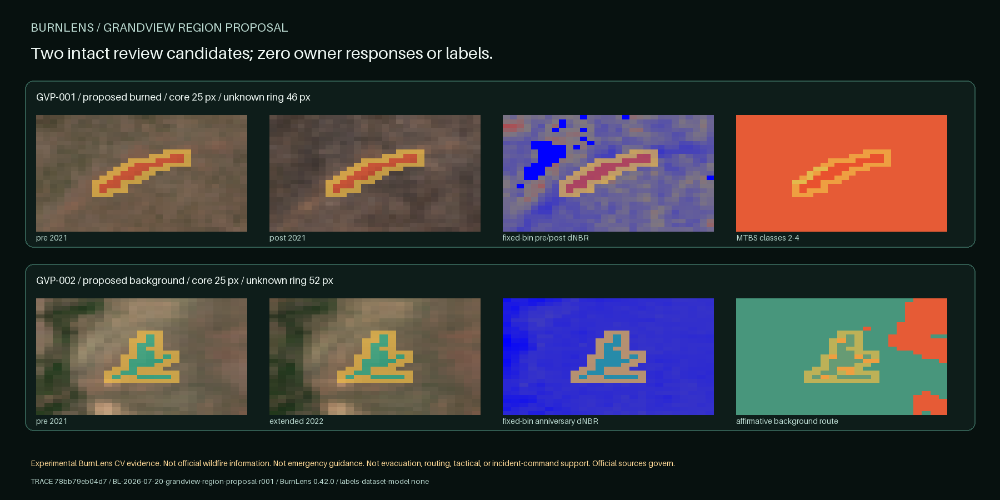

The result is one 25-pixel proposed burned core and one 25-pixel proposed background core, each 1.0 ha, with 46 and 52 unknown-ring pixels. The rendered evidence makes the relatively low pre/post dNBR of the MTBS-backed burned proposal visible rather than silently strengthening the claim. Both regions remain unreviewed. This checkpoint creates no owner response, label, truth claim, dataset, split, baseline, model, metric, field validation, official status, endorsement, or operational readiness.

Release verification then catches a checkout-only JSON defect: the analytical merge converts the new JSON's LF bytes to CRLF because its directory lacks an explicit attribute rule. BurnLens withholds the tag, adds the missing LF contract in issue #513 / PR #514, and proves in a fresh clone that all five original output hashes reconstruct exactly. The remediation changes no evidence, candidate coordinate, raster, or claim.

### Grandview owner review: evidence first, decision second

The verified v0.43 checkpoint did not turn either proposal into a label. It bound the exact v0.42 proposal JSON, both native-grid proposal rasters, schema, run, and region identities into a blank offline owner-review surface. Each candidate page places the proposed class beside the relevant optical and reference evidence, preserves the explicit unknown ring, and makes the proposed burned core's relatively low positive dNBR visible. RAVG is labeled as context only under the delivered sparse/non-tree warning and is absent from affirmative evidence.

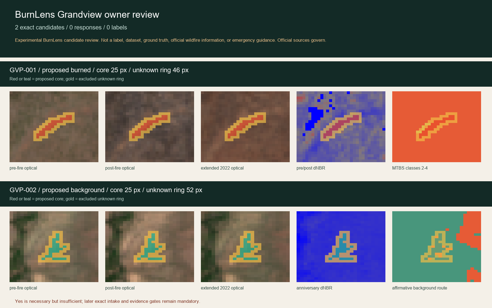

The surface accepts only yes, no, or uncertain, clears stale choices when evidence changes, validates the exact surface/proposal/raster binding, requires owner attestation for completion, locks the completed state, and exports hash-named drafts or responses. The tracked response template remains blank and unattested. This verified surface improves the real decision experience while preserving the separation between review presentation and later controlled response intake. It creates zero owner responses, labels, truth claims, dataset, split, baseline, model, field-validation claim, or operational claim.

### Grandview response intake: approval is one gate, not truth

The owner returns one exact two-decision export. BurnLens validates its surface, run, schema, proposal, raster, chronology, and attestation envelope, copies the exact 887 bytes into ignored repository-local no-overwrite custody, and writes a content-withholding receipt before either decision is opened. Only after that lock passes does the intake read the decisions. Both are yes, but approval alone cannot promote either core.

The hardened r002 path reopens the exact proposal and both rasters, derives their native CRS, grid, 0/1/2 domain, eight-connected 25-pixel cores, and one-pixel unknown rings, and binds 22 exact source, terms, review, and prior-manifest records. The burned core still depends on bounded MTBS evidence; the background core still depends on three-scene optical stability outside all program footprints and exclusions. RAVG remains context only under its sparse/no-tree warning. Both classes must pass before Grandview counts as a complete event.

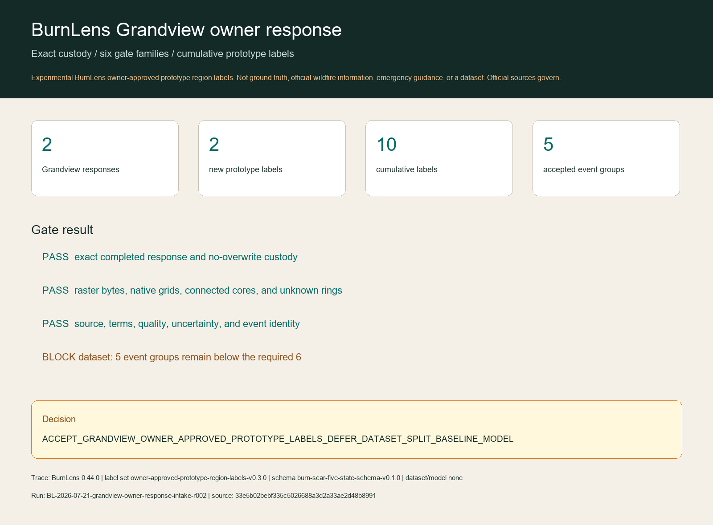

One burned and one background region pass, adding 50 core pixels / 2.00 ha while all 98 ring pixels remain unknown and excluded. Verified label set `owner-approved-prototype-region-labels-v0.3.0` is balanced at five regions per class, 236 core pixels / 9.44 ha, and 431 excluded ring pixels across five complete events. That is better prototype evidence, not independent ground truth, a dataset, a split, a baseline, a model, or field validation. BL-GOV-003 groups issue #521 as one complete milestone rather than a chain of releases. Its material-defer outcome leaves this five-event set unchanged and sends the next cycle to a newly registered official fallback or alternate event, not to early training.

### Petes Lake milestone: preserving a failed route is part of the product

Petes Lake begins with an exact event, source, access, and terms gate, then acquires the frozen Sentinel pair into ignored no-overwrite custody. Opening the actual native pixels reveals that the planned October 29 post scene is 78.0782% SCL snow/ice inside the boundary, leaves only 21.8133% paired eligibility, and passes zero of eight registration windows. BurnLens renders and retains that failure instead of weakening the gate.

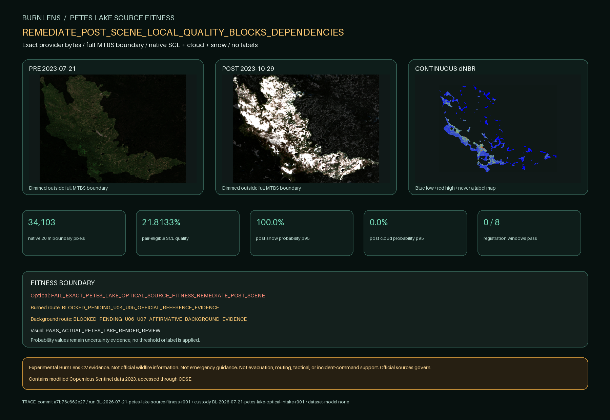

A separately contracted October 19 replacement preserves the source regime and chronology while reaching 97.8360% paired eligibility. Five windows pass; three remain explicit spatial exclusions; none fails. The exact render shows the clear optical pair, continuous dNBR context, exclusions, warnings, and no-label boundary.

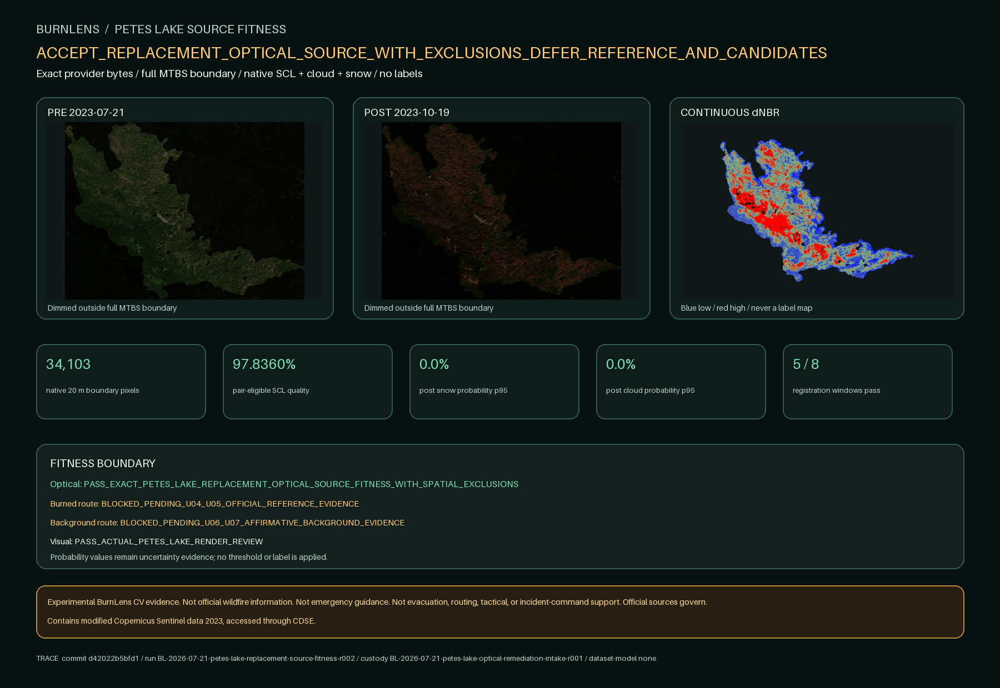

BurnLens then preserves one exact MTBS request/delivery/native-contract chain, including the program's wetland-severity warning, without accepting a reference pixel. U05 requires complete USFWS source-project metadata before those pixels can inform a candidate. Three disjoint NWI intakes make that boundary visible. R001 exposes and fixes a local qualified-field bug. R002 promotes seven assets and stops at a provider-open failure whose cause was not retained. Final r003 repeats the complete, no-retry custody contract; it promotes the same seven assets, then its only Data Source pre-count request observes HTTP 500. Four later assets remain unexecuted.

The decision is `defer`, not silent success or permanent exclusion. R003 is terminal, no r004 is authorized, and partial files cannot satisfy wetland, temporal, grid-coverage, or source-precedence fitness. Production background, proposal, owner-review, response, and label units do not run. Petes Lake does not become event six. Verified BurnLens 0.45.0 packages the custody, source-fitness, batch-review, pre-reveal lock, constrained localhost, and locked geospatial-environment capabilities proven along the way. PR #529 and merge `d65c24f...` correct the package contract, and annotated tag object `0b4664...` peels exactly to the fresh-main-verified checkpoint while the accepted label set remains at five events. This is the portfolio point: reliability includes knowing when evidence is insufficient and making that stop reproducible.

## Traceability snapshot

- AOI: `aoi-darlene3-model-v0.2.0`
- Evidence run: `BL-2026-07-14-aoi-final-r001`
- Target-decision evidence run: `BL-2026-07-14-target-decision-r002`
- Latest optical evidence run: `BL-2026-07-15-optical-pair-evidence-r001`
- Latest registration evidence run: `BL-2026-07-15-content-registration-r001`
- Latest label-proposal run: `BL-2026-07-15-label-proposal-r001`
- Latest separate-QA run: `BL-2026-07-15-label-qa-r001`
- Latest cross-event source run: `RUN-2026-07-15-CROSS-EVENT-SOURCE-001`
- Latest cross-event feasibility run: `RUN-2026-07-15-CROSS-EVENT-FITNESS-001`
- Latest cross-event acquisition run: `BL-2026-07-16-cross-event-optical-intake-r005`
- Latest owner-response intake run: `BL-2026-07-18-owner-response-intake-r002`
- Latest region-candidate pilot run: `BL-2026-07-18-region-candidate-pilot-r006`
- Latest region-owner response-intake run: `BL-2026-07-19-region-owner-response-intake-r001`
- Latest owner-region review-surface run: `BL-2026-07-18-region-owner-review-surface-r005`
- Latest cross-event source-fitness run: `BL-2026-07-16-cross-event-source-fitness-r006`
- Latest MTBS reference run: `BL-2026-07-16-mtbs-cross-event-reference-r003`
- Latest cross-event proposal run: `BL-2026-07-16-cross-event-label-transfer-r004`
- Latest cross-event proposal-QA run: `BL-2026-07-16-cross-event-label-transfer-qa-r004`
- Latest label-review packet run: `BL-2026-07-16-label-review-packet-r001`
- Latest label-review packet-QA run: `BL-2026-07-16-label-review-packet-qa-r001`
- Latest offline handoff run: `BL-2026-07-16-label-review-handoff-r001`
- Latest offline handoff-QA run: `BL-2026-07-16-label-review-handoff-qa-r001`
- Latest live-browser handoff-QA run: `BL-2026-07-16-label-review-browser-qa-r001`
- Latest returned-response public-lock run: `BL-2026-07-16-label-review-response-lock-qa-r001`
- Latest dual-lock custody-readiness run: `BL-2026-07-16-label-review-dual-lock-readiness-qa-r001`
- Latest atomic response-intake QA run: `BL-2026-07-16-label-review-response-atomic-intake-qa-r002`
- Latest owner-waiver reveal-readiness QA run: `BL-2026-07-16-owner-waiver-reveal-readiness-qa-r001`
- Latest single-reviewer reconciliation QA run: `BL-2026-07-16-single-reviewer-reconciliation-qa-r001`
- Latest official-source scout run: `BL-2026-07-17-official-source-scout-r004`
- Latest current-reference bundle-fitness run: `BL-2026-07-17-current-reference-bundle-fitness-r003`
- Latest Green Ridge source-fitness run: `BL-2026-07-19-green-ridge-source-fitness-r001`
- Latest Green Ridge reference-fitness run: `BL-2026-07-19-green-ridge-reference-fitness-r001`
- Latest Green Ridge background-optical acquisition run: `BL-2026-07-20-green-ridge-background-optical-intake-r001`
- Latest Green Ridge background-evidence run: `BL-2026-07-20-green-ridge-background-evidence-r001`
- Latest Green Ridge region-proposal run: `BL-2026-07-20-green-ridge-region-proposal-r001`
- Latest Green Ridge owner-response intake run: `BL-2026-07-20-green-ridge-owner-response-intake-r001`
- Latest Grandview optical acquisition run: `BL-2026-07-20-grandview-optical-intake-r001`
- Latest Grandview source-fitness run: `BL-2026-07-20-grandview-source-fitness-r001`
- Latest Grandview background-optical acquisition run: `BL-2026-07-20-grandview-background-optical-intake-r001`
- Latest Grandview background-evidence run: `BL-2026-07-20-grandview-background-evidence-r001`
- Latest Grandview region-proposal run: `BL-2026-07-20-grandview-region-proposal-r001`
- Latest Grandview owner-review-surface run: `BL-2026-07-21-grandview-owner-review-surface-r001`
- Latest verified Grandview owner-response intake run: `BL-2026-07-21-grandview-owner-response-intake-r002`
- Latest Petes optical replacement-fitness run: `BL-2026-07-21-petes-lake-replacement-source-fitness-r002`
- Latest Petes reference native-contract run: `BL-2026-07-21-petes-lake-reference-native-contract-r001`
- Terminal Petes source-custody run: `BL-2026-07-22-petes-lake-nwi-context-r003`
- Petes milestone closeout run: `BL-2026-07-22-petes-lake-milestone-closeout-r001`
- Acquisition run: `BL-2026-07-14-authenticated-intake-r001`
- Historical tool: BurnLens `0.16.0`; issue #384 / PR #388; analytical merge `836eef75495dbc671bd74a8ad4112852bbf50ac6`; issue #389 / PR #390; corrected checkpoint `27fcd3eadb1473bb603b4275f986bf62022c10bf`; source `ec41129f9322022f28b8f788a2e08ae22145471b`; public artifacts `9fbd97fcb66fd76172fff949580f469fc43b3f40`; tag object `da94fc97efc07b07d9520022fdbff42a85e8ba00`
- Historical tool: BurnLens `0.17.0`; issue #394 / PR #395; merge `eb84aad222a07b89f03a892c2cc0df9540b20d25`; response-lock source `397a28cf9c4385050a516a2892085fcd89cbcaae`; verifier source `ac410ed74a6f5abc13dc8191bac5fa4935e211a5`; public artifacts `1fb920eb1476f470ac9f9216e89a70201e643fab`; tag object `8fca2a51548690b710ad3903a19312e77c748420`
- Historical tool: BurnLens `0.18.0`; issue #402 / PR #404; reviewed head `70a0d25042fdef09e2ecfdd118bc761b08eebfd5`; merge `62a8e8473613938990c40c37f91596470638f036`; source `c4c34dabcde375196dd423d13beb3dd97a32f5e1`; public artifacts `0e338060d9f70d6aa23916fbf8c1965c33209c72`; tag object `572c8cea4314d89717e3c4204078704e799a5fee`
- Historical tool: BurnLens `0.19.0`; issue #407 / PR #408; reviewed head `bb89a7bd36b60379f4c7680ae28837dd51111911`; merge `0ab2b948a4d74c770f6d23042a1d9725642eac42`; source `bc7542bcdeccadaf40d63b521d7fd5a7fc094c81`; public artifacts `d6ecbf2eaf7a159f45d45dd7f4e4815ab6b6363a`; tag object `dca77c6194edfa5aadb5a4a41c5acc9ddf93e6ec`
- Historical tool: BurnLens `0.20.0`; issue #403 / PR #412; merge `4918024dfb83270dbbd83a5880c455cc3c01771c`; source `fda69a60b0a5e350bfe10e7388571d7c1c103735`; public artifacts `57f116aabb7c15e5d0f9d88e8088d2e50c46eb7e`; private reconciliation SHA-256 `a04dd629551a2163e5e7a31f61c3aa95d4fdba136563f3a42940a2e9d1e9249d`; verified tag object `5bb840b43ae8594e02a9b026b3932bb16f83bf5b`
- Failed-release historical tool: BurnLens `0.21.0`; issue #411 / PR #415; merge `f96146aa0702d27eef4964cb61bd7a05d566d7c3`; source `98a9895d203c778dad332db5bdc62b498aa2cd00`; public evidence `f5d4d528263bfc2cf93cb7f128bcb051732797b3`; run `BL-2026-07-17-current-reference-inventory-r002`; analytical tag object `0370bedfce1279da2d104c1ebfd3c1d143ce79ca`; release verification failed on checkout-dependent JSON/HTML bytes
- Historical verified tool: BurnLens `0.34.0`; issue #477 / PR #479; checkpoint `085cb61d0f1add3f5261582acdd746e298c86ba6`; run `BL-2026-07-19-green-ridge-reference-fitness-r001`; tag object `0faed9a847756651ba8d62b7baf475ea72c4229f`; exact Green Ridge optical/reference evidence; dataset absent
- Historical verified tool: BurnLens `0.35.0`; issue #480 / PR #484; checkpoint `b57bcbe5665dcb09a7e716e2e1de4147be4741e4`; contract `678e93c29a07f070f4fb5e289fddbdfa852c9ccb`; generator `92f407f37a32a020c1a47bb1931015b3607c2d89`; artifacts `7ca04102640a108e440054c2693aa6bdc20a02b0`; tag object `d901ea55d683a103bf6f00b8fac55434b65518b4`; 26,126 eligible background-route pixels; zero candidates/labels; next #483
- Prior verified release: `v0.35.0-green-ridge-background-evidence`; checkpoint `b57bcbe5665dcb09a7e716e2e1de4147be4741e4`; tag object `d901ea55d683a103bf6f00b8fac55434b65518b4`; one exact 1,193,992,663-byte extended scene; nine registration windows; 26,126 eligible background-route pixels
- Prior verified release: `v0.36.0-green-ridge-region-proposal`; issue #483 / PR #488; checkpoint `71c3ffedeb2bb54bbeca8e97686c8e37e710e354`; generator `690137f1530a00ca79b8f5831f700541809b2a2b`; artifacts `1858a7a945957fd0cc3d123b325529f9931806c3`; tag object `bc0110afa0c4ccf6e3314d394d544cfde16aaae9`; two 25-pixel unreviewed cores / 87 unknown-ring pixels; zero owner responses/labels; next #487
- Prior verified release: `v0.38.0-green-ridge-owner-response-intake`; issue #491 / PR #496; checkpoint `17bd3652fbb07c096f478224a4d5c173729954c2`; tag object `16f364aac604958d812fb2567dd9cd8b5ea13d6c`; run `BL-2026-07-20-green-ridge-owner-response-intake-r001`; two accepted 25-pixel cores / 87 excluded ring pixels / eight balanced prototype regions across four events
- Prior verified release: `v0.42.0-grandview-region-proposal`; issue #508 / PR #512; remediation #513 / PR #514; checkpoint `6124f76de04b5e503a9da7655a293a023480b39c`; tag object `388c81677b3c49d2312779f8fc98ad3dc7b9048c`; one unreviewed 25-pixel core per class and 98 unknown-ring pixels; zero owner responses or labels
- Prior verified release: `v0.43.0-grandview-owner-review-surface`; issue #511 / PR #518; lifecycle #519 / PR #520; checkpoint `aeea6f5cc488ae975badbdf654d0164570db77c4`; tag object `d679521edcc1d5b1bfd3e8022036cae06a9f1978`; run `BL-2026-07-21-grandview-owner-review-surface-r001`; blank two-candidate yes/no/uncertain surface; zero owner responses or labels
- Prior accepted-label release: `v0.44.0-grandview-owner-response-intake`; issue #517 / PR #522; lifecycle issue #523 / PR #524; checkpoint `5e1d5a05dbb09e8ac42be5928b2d042a0737336e`; tag object `e4f834cd3c55d44895766695a40746fa224df9bd`; run `BL-2026-07-21-grandview-owner-response-intake-r002`; ten balanced prototype regions across five events
- Current verified release: `v0.46.0-official-fallback-source-gate-defer`; issue #532 / PR #533; reviewed head `2e9436e5f30a7810c11313f5731ed07e39e712a0`; checkpoint `0e58459ea45f509eca537223d872fd6992efb291`; tag object `ec2aad7a706c591b23fc0b6c16891ba6be706e95`; exact McKenzie/Milli comparison selects neither; owner-confirmed desktop/narrow render plus fresh-main package/output/tag gates pass; zero provider bytes, candidates, labels, data, or model advancement
- Active deadline gate: P2O4-T35 / issue #534; run `BL-2026-07-23-windigo-entry-gate-r001`; one exact Windigo pair and one three-program delivery are the entire final source attempt; cutoff July 27 at 6:00 PM Indianapolis; technical-case-study-only fallback; U01 acquires zero provider archives and changes no accepted scientific state
- Checkout-stability release: verified BurnLens `0.21.1`; issue #417 / PR #418; source `c99d6f7c932e0f64e5107da0e985ab3bcc2594e7`; merge `65ef67a206ebfa697e6047ca09ce26eec6a24dd7`; tag object `1b84f92cf4e7249e524fab095e233192698b7666`; exact authoritative outputs preserved
- Historical bundle-request checkpoint: verified BurnLens `0.22.0`; issue #421 / PR #422; merge `1bbd3c6385f9a1c543a851a1a278e0ac976a2d57`; tag object `0407f90c855e0e4b62b37c14ae69c5a85cadcaf7`; parent #416; source `725522bd31616a258fcf399fea2a4839165e2791`; public artifacts `921a271858d7de1469e2d53d96d37c46774c126e`; run `BL-2026-07-17-current-reference-bundle-request-r001`; delivery was pending at that checkpoint and was later resolved by verified v0.24
- Repository-truth checkpoint: BL-GOV-002 / issue #400; current workbench and dual-lock paths pass again; authenticated GitHub inventory contains 21 tags and zero Releases; obsolete Phase One backlog is reconciled without changing scientific or custody state
- Checkpoint-cadence governance: BL-GOV-003 / issue #525; `checkpoint-policy-v0.1.0`; evidence units retain independent identities, hashes, gates, dispositions, and failures while milestone and exception checkpoints control shipping cadence; no software, tag, Release, deployment, analytical, custody, owner-decision, dataset, split, baseline, or model change
- Optical shipment: issue #343 / PR #344; merge `136d4d0919eba7144881c22163a149c89fee5a76`; annotated tag object `28d12fb5ef5c70054b8af5fd3c4847ba268000a1`
- Active target: `target-burn-scar-v0.2.0`; active-fire path is complementary reference only
- Target evidence: corrected `TARGET-DECISION-2026-002`; JSON `ac67f6c34a934d639c215ee98b181f1114b5624acafb85f65b1e2f3e804ce4d4`; HTML `0c1279e5e1047ff251dcd65f068d3d45bf2c6982e6a308972205e9d0a76879d4`; PNG `36f221aa6393ad07f14d4d7bb54b1f171ef0636ebb5640a11ab02ab9c5a9b5b0`
- Optical package/protocol: `darlene3-s2-optical-pair-v0.1.0`; `optical-pair-intake-contract-v0.1.0`; `burn-scar-label-protocol-v0.1.0` was design-only at the optical checkpoint and is now implemented as one-event proposal evidence; 2,254,805,631 local/ignored raw bytes; zero committed
- Optical evidence: `OPTICAL-PAIR-2026-001`; pair accepted for protocol evidence; artifact hashes recorded in `MANIFEST-2026-008`
- Registration evidence: `CONTENT-REGISTRATION-2026-001`; all twelve windows pass; analytical merge `c01cdb12033e7a9440ad0502b92a8887fd79ed1d`; LF-contract remediation merge `1297471be45200c40f9f40746e85b437ce6e0c0d`; artifact hashes in `MANIFEST-2026-009`; verified annotated tag object `14edfad3ce89dbd9179a54eb1e29811e41d258c0`
- Label proposal: `darlene3-burn-scar-label-proposal-v0.1.0`; `LABEL-PROPOSAL-2026-001`; five states; 66.5856% candidate domain and 33.4144% ignored; hashes in `MANIFEST-2026-010`
- Label QA: `separate-label-proposal-qa-v0.1.0`; `LABEL-QA-2026-001`; zero state/target mismatch across 270,000 pixels; 120/120 deterministic audit agreement; human inter-rater validation absent
- Cross-event evidence: `CROSS-EVENT-SOURCE-2026-001` and `CROSS-EVENT-FITNESS-2026-001`; exact hashes in `MANIFEST-2026-011`; Tepee/McKay selected, Milli excluded; no imagery downloaded
- Cross-event source fitness: `CROSS-EVENT-SOURCE-FITNESS-2026-001`; exact shipped hashes in `MANIFEST-2026-012`; McKay passes, Tepee exclusions bind; label protocol and implemented five-state schema are explicit; manifest metadata-link exception visible; zero provider bytes committed
- Cross-event proposal/QA: topology-stable `CROSS-EVENT-LABEL-TRANSFER-2026-002` and `CROSS-EVENT-LABEL-TRANSFER-QA-2026-002`; exact shipped hashes in `MANIFEST-2026-014`; zero mismatch across 63,930 pixels; human validation absent; `2026-001` preserved in `MANIFEST-2026-013`
- Label-review readiness: `LABEL-REVIEW-PACKET-2026-001` and `LABEL-REVIEW-PACKET-QA-2026-001`; exact 18-output shipped inventory in `MANIFEST-2026-015`; 56 units / 14 present strata / one structural absence; completed independent responses and adjudications both zero
- Offline reviewer handoff: `LABEL-REVIEW-HANDOFF-2026-001` and `LABEL-REVIEW-HANDOFF-QA-2026-001`; exact seven-output shipped inventory and local archive identity in `MANIFEST-2026-016`; application `label-review-handoff-workbench-v0.1.0`; completed independent responses and adjudications both zero
- Live-browser handoff QA: shipped `LABEL-REVIEW-BROWSER-QA-2026-001`; exact five-output inventory in `MANIFEST-2026-017`; Chrome `150.0.7871.124`; source `74275a061fb4054a535cc8b660bebb0021999c54`; artifacts `97ddbaf71372e119428868a37d214c3327523514`; zero human responses used in the run
- First returned-response lock: shipped `LABEL-REVIEW-RESPONSE-LOCK-QA-2026-001`; exact three-output inventory in `MANIFEST-2026-018`; one private response and receipt ignored; public content withheld; two responses required before adjudication
- Dual-lock custody readiness: shipped `LABEL-REVIEW-DUAL-LOCK-READINESS-QA-2026-001`; exact three-output inventory in `MANIFEST-2026-019`; legacy first pair plus current software fixture; returned-response origins 1; fixture origins 1; no reveal or adjudication
- Atomic response-intake readiness: shipped `LABEL-REVIEW-RESPONSE-ATOMIC-INTAKE-QA-2026-001`; exact three-output inventory in `MANIFEST-2026-020`; fixture source/preserved bytes match; current v0.4.0 receipt; human responses added 0; reveal actions 0
- Owner-waiver reveal readiness: shipped `LABEL-REVIEW-OWNER-WAIVER-REVEAL-READINESS-QA-2026-001`; exact three-output inventory in `MANIFEST-2026-021`; one exact returned response; reviewer two waived and absent; reveal actions 0; issue-#403 reconciliation authorized
- Single-reviewer reconciliation: shipped `LABEL-REVIEW-SINGLE-REVIEWER-RECONCILIATION-QA-2026-001`; 56 units reconciled; 6 burned candidates, 0 background candidates, 50 ignored; Tepee 0 accepted; aggregate-only public evidence; decision remediation / dataset deferred
- Historical reference inventory: verified checkout-stable `CROSS-EVENT-REFERENCE-INVENTORY-2026-001`; Darlene BAER/RAVG, McKay MTBS/RAVG, Tepee BAER/MTBS/RAVG; seven exact catalog identities; official late-2025 archive reprocessing boundary; zero labels promoted; its then-pending bundle fitness was later resolved by v0.24; 0.21.0 failed-release history preserved
- Historical bundle request: verified `CURRENT-REFERENCE-BUNDLE-REQUEST-2026-001`; six standard map IDs plus one explicit nonstandard Tepee BAER path; 18 product families; official queue acceptance; four binding provider cautions; zero archives received at that checkpoint; recipient and retrieval details withheld
- Official-source scout: verified `OFFICIAL-SOURCE-SCOUT-2026-001` / `v0.23.0-official-source-scout`; 12 bounded official responses; 7 source classes; 23 current Deschutes MTBS fires; 21 additional candidates; GW Fire ranked first; Landsat asset access `AUTHENTICATION_REQUIRED`; zero labels
- Verified reference-bundle fitness: `CURRENT-REFERENCE-BUNDLE-FITNESS-2026-001` / `v0.24.0-current-reference-bundle-fitness`; two exact ignored archives / seven products; restricted thresholded Tepee BARC excluded; actual MTBS/RAVG/BAER comparisons; zero owner responses and labels
- Transaction contract: `paired-intake-contract-v0.4.0`
- Source package: `darlene3-s2-viirs-pair-v0.1.0`; raw bytes local/ignored, zero committed
- Observation package: `darlene3-vj214img-observation-screen-v0.2.0`; 24 assets / 83,723,055 bytes local/ignored, zero committed
- Observation contract/protocol: `observation-screen-contract-v0.2.0`; `weak-reference-label-feasibility-v0.1.0`
- Credential records: `ACCESS-2026-006` authorization and `ACCESS-2026-007` / `ACCESS-2026-008` secret-safe exercises
- Observation generator source: `89d50c24a696cc7e3ec023eec00b021a4a0cdda6`
- Historical verified repository baseline: `v0.31.0-region-owner-response-intake` at checkpoint `70dca180d851fadc9ae3b7a897bdf55cf698b3c3`; tag object `3ead929db9129da8da836373a177f2e5ba87c89b`; issue #461 / PR #463; remediation #464 / PR #465; lifecycle #467 / PR #468; next at that checkpoint #466
- Region pilot: generator `407981e1f98570bb8bd7695951d6cc5d67dab042`; artifacts `0e5306c6d94c54b47df40486a75e5bbd69bab62f`; run `BL-2026-07-18-region-candidate-pilot-r006`; six intact candidates / 136 core pixels / 246 unknown-ring pixels / zero region responses / zero labels
- Remediation proof: BurnLens `0.21.1`; fresh merged main preserves the 7,837 / 3,923 / 124,336-byte JSON/HTML/PNG and exact recorded hashes; 188 tests, compilation, dependency health, two byte-identical 348,032-byte wheels / SHA-256 `f8b1f2464fe0599d2bd5f7617a5cbfce244f94e0f3ef68952f84b7d9520d74c2`, isolated 34-entry-point install, 75 wheel entries, and zero forbidden entries pass
- Verified `v0.27.0-prototype-label-sufficiency` proves the 24 sparse owner-approved center pixels are insufficient. Verified `v0.28.0-label-region-remediation-plan` defines contiguous-region review and six-event/source-regime gates. Verified `v0.29.0-region-candidate-pilot` executes six no-promotion regions on actual evidence; issue #457 owned their exact owner-review surface at that checkpoint. This is not review completion, a dataset, or training.
- Dataset / split / baseline / model: not created; five-state proposal schema implemented as reviewable evidence only
- Public application: no deployment; shipped local/offline workbench `label-review-handoff-workbench-v0.1.0`; this repository case study, README, and static evidence reports are the public presentation surfaces

> Experimental BurnLens CV output. Not official wildfire information. Not emergency guidance. Not evacuation, routing, tactical, or incident-command support. Official sources govern.
